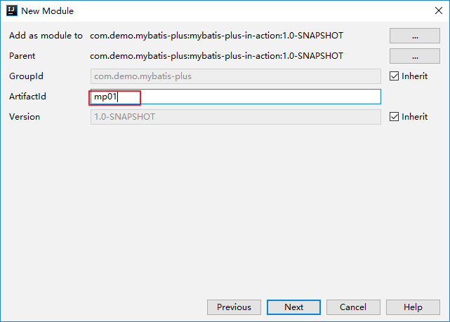
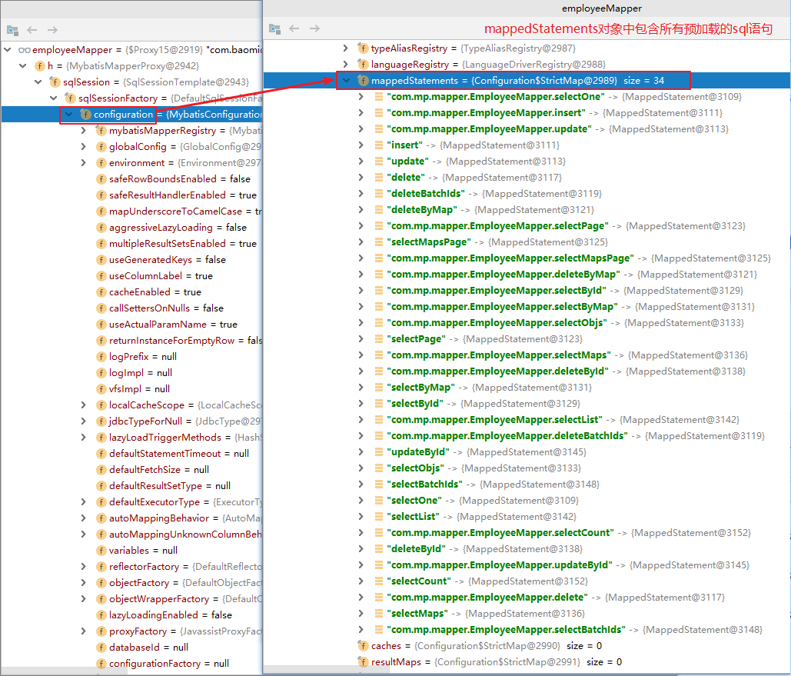
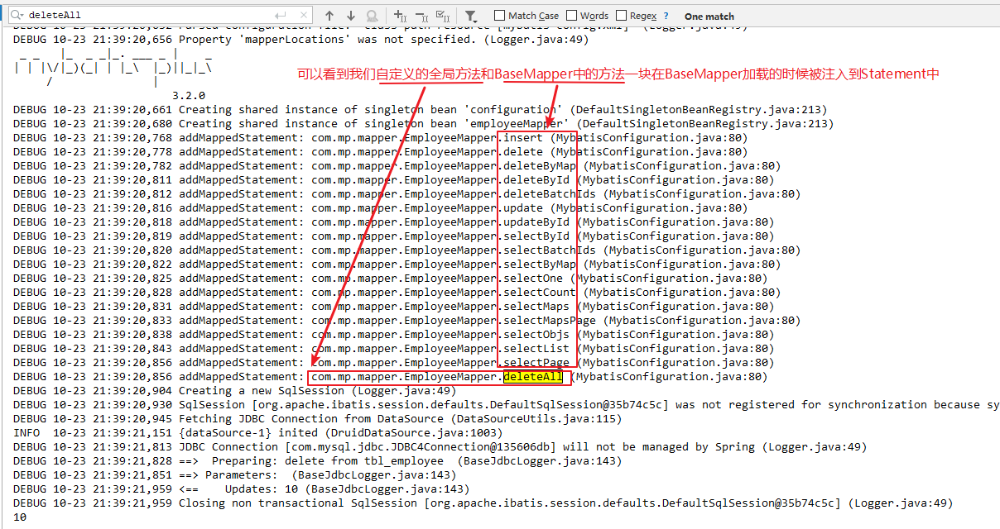

# MyBatis-Plus In Action

[TOC]

## 一、MyBatis-Plus简介

MyBatis-Plus是一款非常强大的MyBatis增强工具包,只做增强不做改变。在不用编写任何SQL语句的情况下即可以极其方便的实现单一、批量、分页等操作。

MyBatis-Plus的增强，其实就是在MyBatis的基础上进行了自己的封装和拓展，可以让使用者不写xml文件，只需简单配置，即可快速进行 CRUD 操作，从而节省大量时间，简化了开发。

本学习笔记是基于MyBatis-Plus最新3.2.0版本和Spring 5.2.0版本 详细讲解：集成Mybatis-Plus、通用CRUD、AbstractWrapper条件构造器、ActiveRecord 等基本操作，更有代码生成器、插件扩展、自定义全局操作、公共字段填充、Idea快速开发插件等高阶技术，通过具体的需求详细讲解如何在Mybatis-Plus原有的基础上进行自定义扩展。完成之后的项目代码结构如下：


更多MyBatis-Plus的介绍及特性，可以前往[MyBatis-Plus](https://mp.baomidou.com/)官网查看。关于基于Springboot集成MyBatis-Plus可以参考官方的[github](https://github.com/baomidou/mybatis-plus-samples)

## 二、快速开始——Spring集成Mybatis-Plus

由于MyBatis-Plus是在MyBatis的基础上只做增强不做改变，因此其与Spring的整合非常简单。只需把MyBatis的依赖换成MyBatis的依赖，再把sqlSessionFactory换成MyBatis-Plus的即可。下面让我们在Spring中快速集成Mybatis-Plus的具体操作：

### 1、准备测试表

```sql
-- 创建库
CREATE DATABASE mp;
-- 使用库
USE mp;
-- 创建表
CREATE TABLE tbl_employee(
id INT(11) PRIMARY KEY AUTO_INCREMENT,
last_name VARCHAR(50),
email VARCHAR(50),
gender CHAR(1),
age int
);
INSERT INTO tbl_employee(last_name,email,gender,age) VALUES('Tom','tom@jianshu.com',1,22);
INSERT INTO tbl_employee(last_name,email,gender,age) VALUES('Jerry','jerry@jianshu.com',0,25);
INSERT INTO tbl_employee(last_name,email,gender,age) VALUES('Black','black@jianshu.com',1,30);
INSERT INTO tbl_employee(last_name,email,gender,age) VALUES('White','white@jianshu.com',0,35);
```

在自己的数据库中执行上面的sql。

### 2、新建Maven项目

#### 2.1、新建一个空的maven父项目

2.1.1、我们在Idea里新建一个Maven父项目，用来管理之后我们所有模块的代码。在Idea中选择`File` → `New` → `Project`


2.1.2、在弹出的页面中选择 `maven` 然后 `Next`


2.1.3、填写自己喜欢的 `groupId` 和 `artifactId`,我这里填的是`com.demo.mybatis-plus`和`mybatis-plus-in-action`，填写完之后然后`Next`


2.1.4、继续点击 `Next`，如果所填路径不存在，Idea会提示是否穿件一个文件，点击`OK`即可


2.1.5、项目创建完毕后删除`src`文件夹，就得到了我们想要的空的父工程，如下图所示


#### 2.2、修改pom文件

核心依赖：

```xml
<!-- mybatis-plus -->
<dependency>
    <groupId>com.baomidou</groupId>
    <artifactId>mybatis-plus</artifactId>
    <version>${mybatis.plus.version}</version>
</dependency>
<!-- spring -->
<dependency>
    <groupId>org.springframework</groupId>
    <artifactId>spring-context</artifactId>
    <version>${spring.version}</version>
</dependency>
<dependency>
    <groupId>org.springframework</groupId>
    <artifactId>spring-orm</artifactId>
    <version>${spring.version}</version>
</dependency>
```

完整依赖：

```xml
<!-- 统一管理项目依赖版本 -->
<properties>
    <mybatis.plus.version>3.2.0</mybatis.plus.version>
    <junit.version>4.12</junit.version>
    <log4j.version>1.2.17</log4j.version>
    <druid.version>1.1.20</druid.version>
    <mysql.version>5.1.48</mysql.version>
    <spring.version>5.2.0.RELEASE</spring.version>
    <lombok.version>1.18.10</lombok.version>
</properties>

<dependencies>
    <!-- mp 依赖
            mybatis-plus 会自动维护 mybatis 以及 mybatis-spring 相关的依赖
            Mybatis 及 Mybatis-Spring 依赖请勿加入项目配置，以免引起版本冲突！！！Mybatis-Plus 会自动帮你维护！
         -->
    <dependency>
        <groupId>com.baomidou</groupId>
        <artifactId>mybatis-plus</artifactId>
        <version>${mybatis.plus.version}</version>
    </dependency>
    <!--junit -->
    <dependency>
        <groupId>junit</groupId>
        <artifactId>junit</artifactId>
        <version>${junit.version}</version>
    </dependency>
    <!-- log4j -->
    <dependency>
        <groupId>log4j</groupId>
        <artifactId>log4j</artifactId>
        <version>${log4j.version}</version>
    </dependency>
    <!-- druid -->
    <dependency>
        <groupId>com.alibaba</groupId>
        <artifactId>druid</artifactId>
        <version>${druid.version}</version>
    </dependency>
    <!-- mysql -->
    <dependency>
        <groupId>mysql</groupId>
        <artifactId>mysql-connector-java</artifactId>
        <version>${mysql.version}</version>
    </dependency>
    <!-- spring -->
    <dependency>
        <groupId>org.springframework</groupId>
        <artifactId>spring-context</artifactId>
        <version>${spring.version}</version>
    </dependency>
    <dependency>
        <groupId>org.springframework</groupId>
        <artifactId>spring-orm</artifactId>
        <version>${spring.version}</version>
    </dependency>
    <!--lombok -->
    <dependency>
        <groupId>org.projectlombok</groupId>
        <artifactId>lombok</artifactId>
        <version>${lombok.version}</version>
        <scope>provided</scope>
    </dependency>
</dependencies>

<!-- 设置JDK编译版本 -->
<build>
    <plugins>
        <plugin>
            <groupId>org.apache.maven.plugins</groupId>
            <artifactId>maven-compiler-plugin</artifactId>
            <version>3.8.1</version>
            <configuration>
                <source>1.8</source>
                <target>1.8</target>
                <encoding>UTF-8</encoding>
            </configuration>
        </plugin>
    </plugins>
</build>
```

#### 2.3、新建mp01模块--快速开始

2.3.1、我们在Idea里新建一个mp01模块，在Idea中选中当前项目 → `New` → `Module` ；填写artifactId，点击 `Next `；确定  `Module name `的名称，点击 `Finish` 完成





2.3.2、新建完成后的项目如下


2.3.3、添加实体类

在 `mp01\src\main\java\com\mp\beans\Employee.java` 路径下添加实体类 `Employee.java`:

```java
@Data
@ToString
public class Employee {
    private Integer id;
    private String lastName;
    private String email;
    private Integer gender;
    private Integer age;
}
```

2.3.4、修改mp01的pom.xml

```xml
<?xml version="1.0" encoding="UTF-8"?>
<project xmlns="http://maven.apache.org/POM/4.0.0"
         xmlns:xsi="http://www.w3.org/2001/XMLSchema-instance"
         xsi:schemaLocation="http://maven.apache.org/POM/4.0.0 http://maven.apache.org/xsd/maven-4.0.0.xsd">
    <parent>
        <artifactId>mybatis-plus-in-action</artifactId>
        <groupId>com.demo.mybatis-plus</groupId>
        <version>1.0-SNAPSHOT</version>
    </parent>
    <modelVersion>4.0.0</modelVersion>

    <artifactId>mp01</artifactId>

    <dependencies>
        <!-- mp 依赖
            mybatis-plus 会自动维护mybatis 以及 mybatis-spring相关的依赖
            Mybatis 及 Mybatis-Spring 依赖请勿加入项目配置，以免引起版本冲突！！！Mybatis-Plus 会自动帮你维护！
         -->
        <dependency>
            <groupId>com.baomidou</groupId>
            <artifactId>mybatis-plus</artifactId>
            <version>${mybatis.plus.version}</version>
        </dependency>
        <!--junit -->
        <dependency>
            <groupId>junit</groupId>
            <artifactId>junit</artifactId>
            <version>${junit.version}</version>
        </dependency>
        <!-- log4j -->
        <dependency>
            <groupId>log4j</groupId>
            <artifactId>log4j</artifactId>
            <version>${log4j.version}</version>
        </dependency>
        <!-- druid -->
        <dependency>
            <groupId>com.alibaba</groupId>
            <artifactId>druid</artifactId>
            <version>${druid.version}</version>
        </dependency>
        <!-- mysql -->
        <dependency>
            <groupId>mysql</groupId>
            <artifactId>mysql-connector-java</artifactId>
            <version>${mysql.version}</version>
        </dependency>
        <!-- spring -->
        <dependency>
            <groupId>org.springframework</groupId>
            <artifactId>spring-context</artifactId>
            <version>${spring.version}</version>
        </dependency>
        <dependency>
            <groupId>org.springframework</groupId>
            <artifactId>spring-orm</artifactId>
            <version>${spring.version}</version>
        </dependency>
        <!--lombok -->
        <dependency>
            <groupId>org.projectlombok</groupId>
            <artifactId>lombok</artifactId>
            <version>${lombok.version}</version>
            <scope>provided</scope>
        </dependency>
    </dependencies>
</project>
```

注意：这里在mp01的pom.xml文件中不添加上述依赖之后项目也是能正常运行的，但是我们加上相关依赖，是为让项目的依赖更加清晰一些

2.3.5、在 `mp01\src\main\resources` 中添加配置文件：

Spring 配置文件——`applicationContext.xml`:

```xml
<?xml version="1.0" encoding="UTF-8"?>
<beans xmlns="http://www.springframework.org/schema/beans"
       xmlns:xsi="http://www.w3.org/2001/XMLSchema-instance"
       xmlns:context="http://www.springframework.org/schema/context"
       xmlns:tx="http://www.springframework.org/schema/tx"
       xmlns:mybatis-spring="http://mybatis.org/schema/mybatis-spring"
       xsi:schemaLocation="http://mybatis.org/schema/mybatis-spring
        http://mybatis.org/schema/mybatis-spring-1.2.xsd
        http://www.springframework.org/schema/beans
        http://www.springframework.org/schema/beans/spring-beans.xsd
        http://www.springframework.org/schema/context
        http://www.springframework.org/schema/context/spring-context-4.0.xsd
        http://www.springframework.org/schema/tx
        http://www.springframework.org/schema/tx/spring-tx-4.0.xsd">

    <!-- 数据源 -->
    <context:property-placeholder location="classpath:db.properties"/>
    <bean id="dataSource"
          class="com.alibaba.druid.pool.DruidDataSource">
        <property name="driverClassName" value="${jdbc.driver}"></property>
        <property name="url" value="${jdbc.url}"></property>
        <property name="username" value="${jdbc.username}"></property>
        <property name="password" value="${jdbc.password}"></property>
    </bean>

    <!-- 事务管理器 -->
    <bean id="dataSourceTransactionManager"
          class="org.springframework.jdbc.datasource.DataSourceTransactionManager">
        <property name="dataSource" ref="dataSource"></property>
    </bean>
    <!-- 基于注解的事务管理 -->
    <tx:annotation-driven
            transaction-manager="dataSourceTransactionManager"/>

    <!-- 配置 SqlSessionFactoryBean
        mybatis提供的：org.mybatis.spring.SqlSessionFactoryBean
        mybatis-plus提供的：com.baomidou.mybatisplus.extension.spring.MybatisSqlSessionFactoryBean
     -->
    <bean id="sqlSessionFactoryBean"
          class="com.baomidou.mybatisplus.extension.spring.MybatisSqlSessionFactoryBean">
        <!-- 数据源 -->
        <property name="dataSource" ref="dataSource"></property>
        <property name="configLocation"
                  value="classpath:mybatis-config.xml"></property>
        <!-- 别名处理 -->
        <property name="typeAliasesPackage"
                  value="com.mp.beans"></property>
    </bean>
    <!--
    配置 mybatis 扫描 mapper 接口的路径
    -->
    <bean class="org.mybatis.spring.mapper.MapperScannerConfigurer">
        <property name="basePackage"
                  value="com.mp.mapper"></property>
    </bean>
</beans>
```

JDBC配置文件—— `db.properties`:

```properties
jdbc.driver=com.mysql.jdbc.Driver
jdbc.url=jdbc:mysql://localhost:3306/mp?useUnicode=true&characterEncoding=UTF-8&useSSL=false
jdbc.username=root
jdbc.password=123456
```

日志文件——`log4j.xml`:

```xml
<?xml version="1.0" encoding="UTF-8" ?>
<!DOCTYPE log4j:configuration SYSTEM "log4j.dtd">
<log4j:configuration xmlns:log4j="http://jakarta.apache.org/log4j/">
    <appender name="STDOUT" class="org.apache.log4j.ConsoleAppender">
        <param name="Encoding" value="UTF-8"/>
        <layout class="org.apache.log4j.PatternLayout">
            <param name="ConversionPattern" value="%-5p %d{MM-dd HH:mm:ss,SSS} %m (%F:%L) \n"/>
        </layout>
    </appender>
    <logger name="java.sql">
        <level value="debug"/>
    </logger>
    <logger name="org.apache.ibatis">
        <level value="info"/>
    </logger>
    <root>
        <level value="debug"/>
        <appender-ref ref="STDOUT"/>
    </root>
</log4j:configuration>
```

`mybatis-config.xml`:

```xml
<?xml version="1.0" encoding="UTF-8" ?>
<!DOCTYPE configuration
        PUBLIC "-//mybatis.org//DTD Config 3.0//EN"
        "http://mybatis.org/dtd/mybatis-3-config.dtd">
<configuration>

</configuration>
```

`注意：mybatis-plus与spring整合，所有mybatis-plus的大部分都写在spring的配置文件中，这里定义一个空的mybatis-config.xml即可`

2.3.6、测试

在 `mp01\src\test\java\com\mp\test\TestMp.java` 路径下添加测试类 `TestMp.java`:

```java
public class TestMp {
    private ApplicationContext iocContext = new
            ClassPathXmlApplicationContext("applicationContext.xml");

    @Test
    public void testEnvironment() throws Exception {
        DataSource ds = iocContext.getBean("dataSource", DataSource.class);
        Connection conn = ds.getConnection();
        System.out.println(conn);
    }
}
```

运行 `testEnvironment`方法后如果能看到 `Connection` 就证明我们的配置可以了。


完成后的项目结构如下：


综上，我们的 `Spring` 集成 `mybatis-plus` 的配置和环境搭建就完成了,下面我们就可以进入到下一节基本CRUD了。

### 源代码

> 相关示例完整代码：[mybatis-plus-in-action](https://github.com/Runewbie/mybatis-plus-in-action)

## 三、基本CRUD操作

上一节我们完成了`mybatis-plus`的集成，也已经在`mp01`中添加相关的实体类的对应的数据库表，这一节我们来实现基于`mybatis-plus`的CRUD操作。

首先按照上一节的操作，新建一个`mp02` 的 `Module`,可以将`mp01`中的内容全部复制过来，同时进行一下修改：

修改 `Employee`实体类:

```java
/**
 * mybatis-plus默认会使用实体类的小写类名作为表名
 */
@Data
@ToString
//@TableName(value = "tbl_employee")  // ==> 全局的表前缀策略配置
public class Employee {

    /**
     * @TableId:
     *      value: 指定表中的主键的列名，如果实体属性名与列名一致，可以省略不指定
     *      type：指定主键策略
     * 设置主键自增
     */
//    @TableId(value = "id", type = IdType.AUTO) // ==> 全局表主键生成策略

    private Integer id;
    @TableField(value = "last_name")
    private String lastName;
    private String email;
    private Integer gender;
    private Integer age;

    // 当前字段是否在数据库中存在，如果不存在则忽略该字段插入到数据库中
    @TableField(exist = false)
    private Double salary;
}
```

修改`applicationContext.xml`文件，添加下面的内容:

```xml
        <property name="configLocation" value="classpath:mybatis-config.xml"></property>
        <!-- 别名处理 -->
        <property name="typeAliasesPackage" value="com.mp.beans"></property>
        <!-- 注入配置-->
        <!--<property name="configuration" ref="configuration"></property>-->
        <!-- 注入全局配置策略-->
        <property name="globalConfig" ref="globalConfiguration"></property>

        <property name="plugins">
            <!-- 分页查询插件 -->
            <bean id="paginationInterceptor" class="com.baomidou.mybatisplus.extension.plugins.PaginationInterceptor">
                <property name="dialectType" value="mysql" />
            </bean>
        </property>

    </bean>

    <!--这个等于Mybatis的全局配置文件，如果在MybatisSqlSessionFactoryBean里面已经配置了configLocation属性（外部加载Mybatis全局配置文件），就不能再配置configuration属性-->
    <bean id="configuration" class="com.baomidou.mybatisplus.core.MybatisConfiguration">
        <!--开启驼峰命名-->
        <property name="mapUnderscoreToCamelCase" value="true"/>
        <!--日志打印SQL语句-->
        <property name="logImpl" value="org.apache.ibatis.logging.log4j.Log4jImpl"></property>
    </bean>

    <!-- 定义mybatis-plus全局策略配置-->
    <bean id="globalConfiguration" class="com.baomidou.mybatisplus.core.config.GlobalConfig">
        <!-- 全局主键策略-->
        <property name="dbConfig" ref="dbConfig"></property>
    </bean>
    <!-- 这里-->
    <bean id="dbConfig" class="com.baomidou.mybatisplus.core.config.GlobalConfig$DbConfig">
        <!-- 全局表主键生成策略 -->
        <property name="idType" value="AUTO"></property>
        <!-- 全局的表前缀策略配置 -->
        <property name="tablePrefix" value="tbl_"></property>
    </bean>
```

完整的xml文件如下：

```xml
<?xml version="1.0" encoding="UTF-8"?>
<beans xmlns="http://www.springframework.org/schema/beans"
       xmlns:xsi="http://www.w3.org/2001/XMLSchema-instance"
       xmlns:context="http://www.springframework.org/schema/context"
       xmlns:tx="http://www.springframework.org/schema/tx"
       xmlns:mybatis-spring="http://mybatis.org/schema/mybatis-spring"
       xsi:schemaLocation="http://mybatis.org/schema/mybatis-spring
        http://mybatis.org/schema/mybatis-spring-1.2.xsd
        http://www.springframework.org/schema/beans
        http://www.springframework.org/schema/beans/spring-beans.xsd
        http://www.springframework.org/schema/context
        http://www.springframework.org/schema/context/spring-context-4.0.xsd
        http://www.springframework.org/schema/tx
        http://www.springframework.org/schema/tx/spring-tx-4.0.xsd">

    <!-- 数据源 -->
    <context:property-placeholder location="classpath:db.properties"/>
    <bean id="dataSource"
          class="com.alibaba.druid.pool.DruidDataSource">
        <property name="driverClassName" value="${jdbc.driver}"></property>
        <property name="url" value="${jdbc.url}"></property>
        <property name="username" value="${jdbc.username}"></property>
        <property name="password" value="${jdbc.password}"></property>
    </bean>

    <!-- 事务管理器 -->
    <bean id="dataSourceTransactionManager"
          class="org.springframework.jdbc.datasource.DataSourceTransactionManager">
        <property name="dataSource" ref="dataSource"></property>
    </bean>
    <!-- 基于注解的事务管理 -->
    <tx:annotation-driven
            transaction-manager="dataSourceTransactionManager"/>

    <!-- 配置 SqlSessionFactoryBean
        mybatis提供的：org.mybatis.spring.SqlSessionFactoryBean
        mybatis-plus提供的：3.2.0 com.baomidou.mybatisplus.extension.spring.MybatisSqlSessionFactoryBean
                2.3 com.baomidou.mybatisplus.spring.MybatisSqlSessionFactoryBean
     -->
    <bean id="sqlSessionFactoryBean"
          class="com.baomidou.mybatisplus.extension.spring.MybatisSqlSessionFactoryBean">
        <!-- 数据源 -->
        <property name="dataSource" ref="dataSource"></property>
        <property name="configLocation" value="classpath:mybatis-config.xml"></property>
        <!-- 别名处理 -->
        <property name="typeAliasesPackage" value="com.mp.beans"></property>
        <!-- 注入配置-->
        <!--<property name="configuration" ref="configuration"></property>-->
        <!-- 注入全局配置策略-->
        <property name="globalConfig" ref="globalConfiguration"></property>

        <property name="plugins">
            <!-- 分页查询插件 -->
            <bean id="paginationInterceptor" class="com.baomidou.mybatisplus.extension.plugins.PaginationInterceptor">
                <property name="dialectType" value="mysql" />
            </bean>
        </property>

    </bean>

    <!--这个等于Mybatis的全局配置文件，如果在MybatisSqlSessionFactoryBean里面已经配置了configLocation属性（外部加载Mybatis全局配置文件），就不能再配置configuration属性-->
    <bean id="configuration" class="com.baomidou.mybatisplus.core.MybatisConfiguration">
        <!--开启驼峰命名-->
        <property name="mapUnderscoreToCamelCase" value="true"/>
        <!--日志打印SQL语句-->
        <property name="logImpl" value="org.apache.ibatis.logging.log4j.Log4jImpl"></property>
    </bean>

    <!-- 定义mybatis-plus全局策略配置-->
    <bean id="globalConfiguration" class="com.baomidou.mybatisplus.core.config.GlobalConfig">
        <!-- 全局主键策略-->
        <property name="dbConfig" ref="dbConfig"></property>
    </bean>
    <!-- 这里-->
    <bean id="dbConfig" class="com.baomidou.mybatisplus.core.config.GlobalConfig$DbConfig">
        <!-- 全局表主键生成策略 -->
        <property name="idType" value="AUTO"></property>
        <!-- 全局的表前缀策略配置 -->
        <property name="tablePrefix" value="tbl_"></property>
    </bean>

    <!--
    配置 mybatis 扫描 mapper 接口的路径
    -->
    <bean class="org.mybatis.spring.mapper.MapperScannerConfigurer">
        <property name="basePackage"
                  value="com.mp.mapper"></property>
    </bean>
</beans>
```

在 `mp02\src\main\java\com\mp\mapper\EmployeeMapper.java` 路径下新建 `EmployeeMapper.java` mapper文件，`EmployeeMapper` 类需要继承 `BaseMapper<T>`,代码如下：

```java
 /**
 * @description： mapper接口
 * 实现方式:
 * 基于 Mybatis
 *      需要编写 EmployeeMapper 接口，并手动编写 CRUD 方法
 *      提供 EmployeeMapper.xml 映射文件，并手动编写每个方法对应的 SQL 语句.
 *
 * 基于 MP
 *      只需要创建 EmployeeMapper 接口, 并继承 BaseMapper 接口.这就是使用 MP
 *      需要完成的所有操作，甚至不需要创建 SQL 映射文件。
 *      BaseMapper<T>：泛型指定的就是当前mapper接口所操作的实体类型
 */
public interface EmployeeMapper extends BaseMapper<Employee> {

    // 使用 mybatis 插入数据时获取主键值
    //   Integer  insertEmployee(Employee employee );
    //   <insert useGeneratedKeys="true" keyProperty="id" > SQL...</insert>
}
```

修改mp02的`pom.xml`文件：

```xml
<?xml version="1.0" encoding="UTF-8"?>
<project xmlns="http://maven.apache.org/POM/4.0.0"
         xmlns:xsi="http://www.w3.org/2001/XMLSchema-instance"
         xsi:schemaLocation="http://maven.apache.org/POM/4.0.0 http://maven.apache.org/xsd/maven-4.0.0.xsd">
    <parent>
        <artifactId>mybatis-plus-in-action</artifactId>
        <groupId>com.demo.mybatis-plus</groupId>
        <version>1.0-SNAPSHOT</version>
    </parent>
    <modelVersion>4.0.0</modelVersion>

    <artifactId>mp02</artifactId>


    <dependencies>
        <!-- mp 依赖
            mybatis-plus 会自动维护mybatis 以及 mybatis-spring相关的依赖
            Mybatis 及 Mybatis-Spring 依赖请勿加入项目配置，以免引起版本冲突！！！Mybatis-Plus 会自动帮你维护！
         -->
        <dependency>
            <groupId>com.baomidou</groupId>
            <artifactId>mybatis-plus</artifactId>
            <version>${mybatis.plus.version}</version>
        </dependency>
        <!--junit -->
        <dependency>
            <groupId>junit</groupId>
            <artifactId>junit</artifactId>
            <version>${junit.version}</version>
        </dependency>
        <!-- log4j -->
        <dependency>
            <groupId>log4j</groupId>
            <artifactId>log4j</artifactId>
            <version>${log4j.version}</version>
        </dependency>
        <!-- druid -->
        <dependency>
            <groupId>com.alibaba</groupId>
            <artifactId>druid</artifactId>
            <version>${druid.version}</version>
        </dependency>
        <!-- mysql -->
        <dependency>
            <groupId>mysql</groupId>
            <artifactId>mysql-connector-java</artifactId>
            <version>${mysql.version}</version>
        </dependency>
        <!-- spring -->
        <dependency>
            <groupId>org.springframework</groupId>
            <artifactId>spring-context</artifactId>
            <version>${spring.version}</version>
        </dependency>
        <dependency>
            <groupId>org.springframework</groupId>
            <artifactId>spring-orm</artifactId>
            <version>${spring.version}</version>
        </dependency>
        <!--lombok -->
        <dependency>
            <groupId>org.projectlombok</groupId>
            <artifactId>lombok</artifactId>
            <version>${lombok.version}</version>
            <scope>provided</scope>
        </dependency>
    </dependencies>
</project>
```

上面的准备工作做完了，下面我们可以来进行CRUD操作了：

### 1、insert操作

```java
/**
* 通用 插入操作
*/
@Test
public void testCommonInsert() {
    // 初始化employee 对象
    Employee employee = new Employee();
    employee.setLastName("MP");
    employee.setEmail("mp@github.com");
    employee.setGender(1);
    employee.setAge(22);

    employee.setSalary(2000.0);

    // 插入到数据库 insert方法在插入时， 会根据实体类的每个属性进行非空判断，只有非空的属性对应的字段才会出现到SQL语句中
    int ret = employeeMapper.insert(employee);
    System.out.println("result：" + ret);

    // 获取当前数据在数据库中的主键值
    Integer key = employee.getId();
    System.out.println("key：" + key);
}
```

### 2、update操作

```java
/**
* 通用更新操作
*/
@Test
public void testCommonUpdate() {
    // 初始化employee 对象
    Employee employee = new Employee();
    employee.setId(19);
    employee.setLastName("MP");
    employee.setEmail("mybatis-plus@github.com");
    employee.setGender(0);
    // employee.setAge(33); // 没有传的字段不会被更新

    // 单个更新
    Integer result = employeeMapper.updateById(employee);
    System.out.println("result：" + result);

    // 批量更新， 如果 Wrapper 为空，则全部更新
    result = employeeMapper.update(employee, null);
    System.out.println("result：" + result);
}
```

### 3、select操作

```java
/**
* 通用查询操作
*/
@Test
public void testCommonSelect() {
    // 1、通过id查询
    Employee employee = employeeMapper.selectById(14);
    System.out.println(employee);

    // 2、通过多个列查询 id+lastName
    Employee employee1 = new Employee();
    employee1.setId(13);
    employee1.setLastName("White");
    Wrapper<Employee> employeeWrapper = new QueryWrapper<Employee>(employee1);
    Employee selectOne = employeeMapper.selectOne(employeeWrapper);
    System.out.println(selectOne);

    // 3、通过多个id进行查询
    List<Integer> idList = new ArrayList<Integer>();
    idList.add(11);
    idList.add(12);
    idList.add(13);
    idList.add(14);
    List<Employee> employeeList = employeeMapper.selectBatchIds(idList);
    System.out.println("employeeList：" + employeeList);

    // 4、通过 selectMaps 查询
    Map<String, Object> columnMap = new HashMap<String, Object>();
    columnMap.put("last_name", "White");
    columnMap.put("gender", 0);
    List<Employee> selectByMap = employeeMapper.selectByMap(columnMap);
    System.out.println("selectByMap：" + selectByMap);

    // 5、分页查询 selectPage 使用分页查询需要在 applicationContext.xml 中添加 分页查询插件 配置
    IPage<Employee> employeeIPage = employeeMapper.selectPage(new Page<>(2, 1), null);
    System.out.println("employeeIPage：" + employeeIPage.getRecords());
}
```

`注意：`

1、columnMap中使用的是数据库中的字段名，而不是实体类的字段名

2、分页查询操作需要在 `applicationContext.xml` 中添加分页插件，完整代码可以看前面的完整配置：

```xml
<property name="plugins">
    <!-- 分页查询插件 -->
    <bean id="paginationInterceptor" class="com.baomidou.mybatisplus.extension.plugins.PaginationInterceptor">
        <property name="dialectType" value="mysql" />
    </bean>
</property>
```

### 4、delet操作

```java
/**
* 通用删除操作
*/
@Test
public void testCommonDelete() {
    // 1、根据id删除
    Integer result = employeeMapper.deleteById(15);
    System.out.println("result：" + result);

    // 2、根据 deleteByMap 条件删除
    Map<String, Object> columnMap  = new HashMap<>();
    columnMap.put("last_name","MP");
    columnMap.put("email","mybatis-plus@github.com");
    Integer ret = employeeMapper.deleteByMap(columnMap);
    System.out.println("ret：" + ret);

    // 3、批量删除
    List<Integer> idList = new ArrayList<Integer>();
    idList.add(18);
    idList.add(19);
    Integer deleteResult = employeeMapper.deleteBatchIds(idList);
    System.out.println("deleteResult：" + deleteResult);
}
```

`注意：`columnMap中使用的是数据库中的字段名，而不是实体类的字段名

### 5、完整测试代码

```java
public class TestMp {
    private ApplicationContext ioc = new
            ClassPathXmlApplicationContext("applicationContext.xml");

    private EmployeeMapper employeeMapper = ioc.getBean("employeeMapper", EmployeeMapper.class);

    /**
     * 通用删除操作
     */
    @Test
    public void testCommonDelete() {
        // 1、根据id删除
        Integer result = employeeMapper.deleteById(15);
        System.out.println("result：" + result);

        // 2、根据 deleteByMap 条件删除
        Map<String, Object> columnMap  = new HashMap<>();
        columnMap.put("last_name","MP");
        columnMap.put("email","mybatis-plus@github.com");
        Integer ret = employeeMapper.deleteByMap(columnMap);
        System.out.println("ret：" + ret);

        // 3、批量删除
        List<Integer> idList = new ArrayList<Integer>();
        idList.add(18);
        idList.add(19);
        Integer deleteResult = employeeMapper.deleteBatchIds(idList);
        System.out.println("deleteResult：" + deleteResult);
    }

    /**
     * 通用查询操作
     */
    @Test
    public void testCommonSelect() {
        // 1、通过id查询
        Employee employee = employeeMapper.selectById(14);
        System.out.println(employee);

        // 2、通过多个列查询 id+lastName
        Employee employee1 = new Employee();
        employee1.setId(13);
        employee1.setLastName("White");
        Wrapper<Employee> employeeWrapper = new QueryWrapper<Employee>(employee1);
        Employee selectOne = employeeMapper.selectOne(employeeWrapper);
        System.out.println(selectOne);

        // 3、通过多个id进行查询
        List<Integer> idList = new ArrayList<Integer>();
        idList.add(11);
        idList.add(12);
        idList.add(13);
        idList.add(14);
        List<Employee> employeeList = employeeMapper.selectBatchIds(idList);
        System.out.println("employeeList：" + employeeList);

        // 4、通过 selectMaps 查询
        Map<String, Object> columnMap = new HashMap<String, Object>();
        columnMap.put("last_name", "White");
        columnMap.put("gender", 0);
        List<Employee> selectByMap = employeeMapper.selectByMap(columnMap);
        System.out.println("selectByMap：" + selectByMap);

        // 5、分页查询 selectPage 使用分页查询需要在 applicationContext.xml 中添加 分页查询插件 配置
        IPage<Employee> employeeIPage = employeeMapper.selectPage(new Page<>(2, 1), null);
        System.out.println("employeeIPage：" + employeeIPage.getRecords());
    }

    /**
     * 通用更新操作
     */
    @Test
    public void testCommonUpdate() {
        // 初始化employee 对象
        Employee employee = new Employee();
        employee.setId(19);
        employee.setLastName("MP");
        employee.setEmail("mybatis-plus@github.com");
        employee.setGender(0);
//        employee.setAge(33);

        // 单个更新
        Integer result = employeeMapper.updateById(employee);
        System.out.println("result：" + result);

        // 批量更新， 如果 Wrapper 为空，则全部更新
        result = employeeMapper.update(employee, null);
        System.out.println("result：" + result);
    }

    /**
     * 通用 插入操作
     */
    @Test
    public void testCommonInsert() {
        // 初始化employee 对象
        Employee employee = new Employee();
        employee.setLastName("MP");
        employee.setEmail("mp@github.com");
        employee.setGender(1);
        employee.setAge(22);

        employee.setSalary(2000.0);

        // 插入到数据库 insert方法在插入时， 会根据实体类的每个属性进行非空判断，只有非空的属性对应的字段才会出现到SQL语句中
        int ret = employeeMapper.insert(employee);
        System.out.println("result：" + ret);

        // 获取当前数据在数据库中的主键值
        Integer key = employee.getId();
        System.out.println("key：" + key);
    }

    @Test
    public void testEnvironment() throws Exception {
        DataSource ds = ioc.getBean("dataSource", DataSource.class);
        Connection conn = ds.getConnection();
        System.out.println(conn);
    }
}
```

完成上面的操作后，mp02的代码结构如下所示：


### 6、Mybatis-Plus启动注入SQL原理分析

#### 6.1、问题：

在我们使用 BaseMapper 提供的方法来进行CRUD操作的时候，有没有想过为什么我们能直接使用这些方法，而这些方法又是什么时候加载到容器中呢？

xxxMapper 继承了 BaseMapper<T>, BaseMapper 中提供了通用的 CRUD 方法,这些方法来源于 BaseMapper, 有方法就必须有 SQL, 因为 MyBatis 最终还是需要通过SQL 语句操作数据。以为 Mybatis-Plus 是在MyBatis 的基础上做了增强，所以我们有必要了解一些前置知识：

MyBatis 源码中比较重要的一些对象， MyBatis 框架的执行流程
`Configuration`：MyBatis 的全局配置对象
`MappedStatement`：MappedStatement保存所有的SQL方法和执行语句
……..

#### 6.2、通过现象看到本质：

通过debug日志我们可以看到，在我们执行 employeeMapper.deleteById(id)方法之前，Mybatis-Plus已经帮我们把 BaseMapper 中内置的方法就加载到了MappedStatement中。


我们在 employeeMapper.deleteById(id)方法中打下断点，可以看到

A． `employeeMapper` 的本质是`com.baomidou.mybatisplus.core.override.MybatisMapperProxy `，如果是mybatis 则看到的是 `org.apache.ibatis.binding.MapperProxy`

B． MapperProxy 中两个重要对象 `sqlSession` –>`SqlSessionFactory`


C． `SqlSessionFacotry` 中又有两个重要的对象 `Configuration`→ `MappedStatements`


每一个 mappedStatement 都表示 Mapper 接口中的一个方法与 Mapper 映射文件中的一个 SQL。



Mybatis-Plus 在启动就会挨个分析 xxxMapper 中的方法，并且将对应的 SQL 语句处理好，保存到 `configuration` 对象中的 `mappedStatements` 中.
D． 本质:
`Configuration`： MyBatis 或者 MP 全局配置对象

`MappedStatement`：一个 MappedStatement 对象对应 Mapper 配置文件中的一个select/update/insert/delete 节点，主要描述的是一条 SQL 语句
`SqlMethod` : 枚举对象 ， MP 支持的 SQL 方法
`TableInfo`： 数据库表反射信息 ，可以获取到数据库表相关的信息
`SqlSource`: SQL 语句处理对象
`MapperBuilderAssistant`： 用于缓存、 SQL 参数、查询方剂结果集处理等，通过 MapperBuilderAssistant 将每一个 mappedStatement添加到 configuration 中的 mappedstatements 中 。

在下图所示的位置处打断点，可以观测到MP加载内置方法的整个过程，我们在后边自定义全局操作添加自定义方法的时候，还会碰到`AbstractMethod`对象和`AbstractSqlInjector`对象，


Mybatis-Plus启动注入SQL的执行流程入下入所示(中间省略若干非关键步骤)：


以上是基本的 CRUD 操作， 你所见，我们仅仅需要继承一个 BaseMapper 即可实现大部分单表 CRUD 操作。 BaseMapper 提供了多达 17 个方法给大家使用, 可以极其方便的实现单一、批量、分页等操作。 极大的减少开发负担。

综上，基于 `mybatis-plus` 的CRUD演示就完成了,现有一个需求，我们需要分页查询 tbl_employee 表中，年龄在 18~50 之间性别为男且姓名为 xx 的所有用户，这时候我们该如何实现上述需求呢？

MyBatis : 需要在 SQL 映射文件中编写带条件查询的 SQL,并基于 PageHelper 插件完成分页. 实现以上一个简单的需求，往往需要我们做很多重复单调的工作。 普通的 Mapper能够解决这类痛点吗？
MP: 依旧不用编写 SQL 语句, MP 提供了功能强大的条件构造器 `AbstractWrapper`。下面我们就可以进入到下一节`AbstractWrapper条件构造器`了。

### 源代码

> 相关示例完整代码：[mybatis-plus-in-action](https://github.com/Runewbie/mybatis-plus-in-action)

## 四、条件构造器——AbstractWrapper

上一节我们完成了基于`mybatis-plus`的CRUD操作，这一节我们来学习一下使用`mybatis-plus`中的条件构造器——`AbstractWrapper`,我们主要使用的是`QueryWrapper`来演示，其他的大家自己可以尝试。

首先我们来介绍一下`AbstractWrapper`,下图是`AbstractWrapper`的一个继承结构：


1) `Mybatis-Plus` 通过 `QueryWrapper`（ MP 封装的一个查询条件构造器，继承自`AbstractWrapper`，`AbstractWrapper` 实现了 `Wrapper`等接口） 来让用户自由的构建查询条件，简单便捷，没有额外的负担，能够有效提高开发效率
2) 查询包装器`QueryWrapper`， 主要用于处理 sql 拼接，排序，实体参数查询等
3) 注意: 使用的是数据库字段，不是 Java 属性!
4) 条件参数说明:

| 查询方式  |        说明         |
| :-------: | :-----------------: |
|    or     |     或条件语句      |
|    and    |     且条件语句      |
|   like    |    模糊查询 like    |
|  notLike  |  模糊查询 not Like  |
|  exists   |   exists 条件语句   |
| notExists | not Exists 条件语句 |
|  isNull   |     null 值查询     |
| isNotNull |  is Not Null 查询   |
|    in     |       in 查询       |
|   notIn   |     not in 查询     |
|  groupBy  |      分组查询       |
|  orderBy  |      排序查询       |
|  having   |     分组后筛选      |
|    eq     |       等于 =        |
|    ne     |      不等于 <>      |
|  between  |  between 条件语句   |
|    ···    |         ···         |

首先按照`快速开始——Spring集成Mybatis-Plus`一节的操作，新建一个`mp03` 的 `Module`,可以将`mp02`中的内容全部复制过来，删除`TestMp.class`的内容，以便我们使用条件构造器，在此之前我们先修改一下修改mp03的`pom.xml`文件：

```xml
<?xml version="1.0" encoding="UTF-8"?>
<project xmlns="http://maven.apache.org/POM/4.0.0"
         xmlns:xsi="http://www.w3.org/2001/XMLSchema-instance"
         xsi:schemaLocation="http://maven.apache.org/POM/4.0.0 http://maven.apache.org/xsd/maven-4.0.0.xsd">
    <parent>
        <artifactId>mybatis-plus-in-action</artifactId>
        <groupId>com.demo.mybatis-plus</groupId>
        <version>1.0-SNAPSHOT</version>
    </parent>
    <modelVersion>4.0.0</modelVersion>

    <artifactId>mp03</artifactId>


    <dependencies>
        <!-- mp 依赖
            mybatis-plus 会自动维护mybatis 以及 mybatis-spring相关的依赖
            Mybatis 及 Mybatis-Spring 依赖请勿加入项目配置，以免引起版本冲突！！！Mybatis-Plus 会自动帮你维护！
         -->
        <dependency>
            <groupId>com.baomidou</groupId>
            <artifactId>mybatis-plus</artifactId>
            <version>${mybatis.plus.version}</version>
        </dependency>
        <!--junit -->
        <dependency>
            <groupId>junit</groupId>
            <artifactId>junit</artifactId>
            <version>${junit.version}</version>
        </dependency>
        <!-- log4j -->
        <dependency>
            <groupId>log4j</groupId>
            <artifactId>log4j</artifactId>
            <version>${log4j.version}</version>
        </dependency>
        <!-- druid -->
        <dependency>
            <groupId>com.alibaba</groupId>
            <artifactId>druid</artifactId>
            <version>${druid.version}</version>
        </dependency>
        <!-- mysql -->
        <dependency>
            <groupId>mysql</groupId>
            <artifactId>mysql-connector-java</artifactId>
            <version>${mysql.version}</version>
        </dependency>
        <!-- spring -->
        <dependency>
            <groupId>org.springframework</groupId>
            <artifactId>spring-context</artifactId>
            <version>${spring.version}</version>
        </dependency>
        <dependency>
            <groupId>org.springframework</groupId>
            <artifactId>spring-orm</artifactId>
            <version>${spring.version}</version>
        </dependency>
        <!--lombok -->
        <dependency>
            <groupId>org.projectlombok</groupId>
            <artifactId>lombok</artifactId>
            <version>${lombok.version}</version>
            <scope>provided</scope>
        </dependency>
    </dependencies>
</project>
```

下面开始我们的QueryWrapper的演示：

### 1、使用QueryWrapper的更新操作

```java
/**
 * 条件构造器 更新操作
 */
@Test
public void testWrapperUpdate() {

    Employee employee = new Employee();
    employee.setLastName("XP");
    employee.setEmail("xp@github.com");
    employee.setGender(0);
    employeeMapper.update(employee,
            new QueryWrapper<Employee>()
                    .eq("age", 22)
                    .eq("last_name", "MP")
    );
}
```

### 2、使用QueryWrapper的查询操作

```java
/**
 * 条件构造器 查询操作
 */
@Test
public void testWrapperSelect() {
    // 分页查询 tbl_employee 表中，年龄在 18~50 之间性别为男且
    // 姓名为 xx 的所有用户
    IPage<Employee> page = employeeMapper.selectPage(new Page<Employee>(1, 3),
            new QueryWrapper<Employee>()
                    .between("age", 18, 50)
                    .eq("gender", 1)
                    .eq("last_name", "MP")
    );
    System.out.println(page.getRecords());

    // 查询 tbl_employee 表中，名字中带有M 性别为女 或者邮箱中带有a的
    List<Employee> employees = employeeMapper.selectList(
            new QueryWrapper<Employee>()
                    .eq("gender", 0)
                    .like("last_name", "M")
                    .or() // SQL：(gender = ? AND last_name LIKE ? OR email LIKE ?)
                    .like("email", "a")
    );
    System.out.println(employees);

    // 带排序的查询
    List<Employee> list = employeeMapper.selectList(
            new QueryWrapper<Employee>()
                    .eq("gender", 1)
//                        .orderBy(true, true, "age")
                    .orderByDesc("age")
    );

    System.out.println(list);
}
```

### 3、使用QueryWrapper的删除操作

```java
/**
 * 条件构造器 删除操作
 */
@Test
public void testWrapperDelete() {
    employeeMapper.delete(
            new QueryWrapper<Employee>()
                    .eq("age", 22)
                    .eq("last_name", "MP")
    );
}
```

### 4、完整的测试代码

```java

public class TestMp {
    private ApplicationContext ioc = new
            ClassPathXmlApplicationContext("applicationContext.xml");

    private EmployeeMapper employeeMapper = ioc.getBean("employeeMapper", EmployeeMapper.class);

    /**
     * 条件构造器 删除操作
     */
    @Test
    public void testWrapperDelete() {
        employeeMapper.delete(
                new QueryWrapper<Employee>()
                        .eq("age", 22)
                        .eq("last_name", "MP")
        );
    }

    /**
     * 条件构造器 更新操作
     */
    @Test
    public void testWrapperUpdate() {

        Employee employee = new Employee();
        employee.setLastName("XP");
        employee.setEmail("xp@github.com");
        employee.setGender(0);
        employeeMapper.update(employee,
                new QueryWrapper<Employee>()
                        .eq("age", 22)
                        .eq("last_name", "MP")
        );
    }


    /**
     * 条件构造器 查询操作
     */
    @Test
    public void testWrapperSelect() {
        // 分页查询 tbl_employee 表中，年龄在 18~50 之间性别为男且
        // 姓名为 xx 的所有用户
        IPage<Employee> page = employeeMapper.selectPage(new Page<Employee>(1, 3),
                new QueryWrapper<Employee>()
                        .between("age", 18, 50)
                        .eq("gender", 1)
                        .eq("last_name", "MP")
        );
        System.out.println(page.getRecords());

        // 查询 tbl_employee 表中，名字中带有M 性别为女 或者邮箱中带有a的
        List<Employee> employees = employeeMapper.selectList(
                new QueryWrapper<Employee>()
                        .eq("gender", 0)
                        .like("last_name", "M")
                        .or() // SQL：(gender = ? AND last_name LIKE ? OR email LIKE ?)
                        .like("email", "a")
        );
        System.out.println(employees);

        // 带排序的查询
        List<Employee> list = employeeMapper.selectList(
                new QueryWrapper<Employee>()
                        .eq("gender", 1)
//                        .orderBy(true, true, "age")
                        .orderByDesc("age")
        );

        System.out.println(list);
    }

}
```

完成上面的操作后，mp03的代码结构如下所示：


至此，基于 `mybatis-plus` 的条件构造器——QueryWrapper演示就完成了,下面我们就可以进入到下一节`ActiveRecord(活动记录)`了。

### 源代码

> 相关示例完整代码：[mybatis-plus-in-action](https://github.com/Runewbie/mybatis-plus-in-action)

## 五、ActiveRecord(活动记录)

上一节我们学习基于 `mybatis-plus` 的条件构造器——QueryWrapper,这一节我们来学习一下`mybatis-plus` 的`ActiveRecord(活动记录)`。

在开始之前，我们先来了解一下什么是ActiveRecord(活动记录)？

> Active Record(活动记录)，是一种领域模型模式，特点是一个模型类对应关系型数据库中的一个表，而模型类的一个实例对应表中的一行记录。 
>
> ActiveRecord 一直广受动态语言（ PHP 、 Ruby 等）的喜爱，而 Java 作为准静态语言，对于 ActiveRecord 往往只能感叹其优雅，所以 MP 也在 AR 道路上进行了一定的探索 

那么我们如何使用AR模式呢？

> 仅仅需要让实体类继承 Model 类且实现主键指定方法，即可开启 AR 之旅 。

下面我们来介绍详细内容，首先按照`快速开始——Spring集成Mybatis-Plus`一节的操作，新建一个`mp04` 的 `Module`,可以将`mp02`中的内容全部复制过来，然后进行下面的修改：

修改 `Employee`实体类:

```java
 /**
 * mybatis-plus 默认会使用实体类的小写类名作为表名
 *
 * 继承 Model 类，开启AR模式
 */
@Data
@ToString
public class Employee extends Model<Employee> {

    private Integer id;
    private String lastName;
    private String email;
    private Integer gender;
    private Integer age;

    // 当前字段是否在数据库中存在，如果不存在则忽略该字段插入到数据库中
    @TableField(exist = false)
    private Double salary;

    // 注意：我们这里需要重写pkVal()方法，return当前类的主键。 在实际的实践中，发现如果未重写pkVal()方法，并不会影响AR的使用
    @Override
    protected Serializable pkVal() {
        return this.id;
    }
}
```

`注意`:mybatis-plus 默认会使用实体类的小写类名作为表名，因为我们在 `applicationContext.xml` 中已经配置了表的前缀生成策略

```xml
<bean id="dbConfig" class="com.baomidou.mybatisplus.core.config.GlobalConfig$DbConfig">
    <!-- 全局表主键生成策略 -->
    <property name="idType" value="AUTO"></property>
    <!-- 全局的表前缀策略配置 -->
    <property name="tablePrefix" value="tbl_"></property>
</bean>
```

所以，不会出现数据库表和实体类不匹配的状况，如果想要使用单独的表名，可以在实体类上使用`@TableName("表名") `注解。

```java
@TableName("tbl_employee")
public class Employee extends Model<Employee>{
// .. fields
// .. getter and setter
    @Override
    protected Serializable pkVal() {
    	return this.id;
    }
}
```

`注意`：mapper不用做修改,但是也不能少,虽然AR模式用不到该接口，但一定要定义，否则使用AR时会报空指针异常。

```java
public interface EmployeeMapper extends BaseMapper<Employee> {
}
```

修改mp04的`pom.xml`文件：

```xml
<?xml version="1.0" encoding="UTF-8"?>
<project xmlns="http://maven.apache.org/POM/4.0.0"
         xmlns:xsi="http://www.w3.org/2001/XMLSchema-instance"
         xsi:schemaLocation="http://maven.apache.org/POM/4.0.0 http://maven.apache.org/xsd/maven-4.0.0.xsd">
    <parent>
        <artifactId>mybatis-plus-in-action</artifactId>
        <groupId>com.demo.mybatis-plus</groupId>
        <version>1.0-SNAPSHOT</version>
    </parent>
    <modelVersion>4.0.0</modelVersion>

    <artifactId>mp04</artifactId>


    <dependencies>
        <!-- mp 依赖
            mybatis-plus 会自动维护mybatis 以及 mybatis-spring相关的依赖
            Mybatis 及 Mybatis-Spring 依赖请勿加入项目配置，以免引起版本冲突！！！Mybatis-Plus 会自动帮你维护！
         -->
        <dependency>
            <groupId>com.baomidou</groupId>
            <artifactId>mybatis-plus</artifactId>
            <version>${mybatis.plus.version}</version>
        </dependency>
        <!--junit -->
        <dependency>
            <groupId>junit</groupId>
            <artifactId>junit</artifactId>
            <version>${junit.version}</version>
        </dependency>
        <!-- log4j -->
        <dependency>
            <groupId>log4j</groupId>
            <artifactId>log4j</artifactId>
            <version>${log4j.version}</version>
        </dependency>
        <!-- druid -->
        <dependency>
            <groupId>com.alibaba</groupId>
            <artifactId>druid</artifactId>
            <version>${druid.version}</version>
        </dependency>
        <!-- mysql -->
        <dependency>
            <groupId>mysql</groupId>
            <artifactId>mysql-connector-java</artifactId>
            <version>${mysql.version}</version>
        </dependency>
        <!-- spring -->
        <dependency>
            <groupId>org.springframework</groupId>
            <artifactId>spring-context</artifactId>
            <version>${spring.version}</version>
        </dependency>
        <dependency>
            <groupId>org.springframework</groupId>
            <artifactId>spring-orm</artifactId>
            <version>${spring.version}</version>
        </dependency>
        <!--lombok -->
        <dependency>
            <groupId>org.projectlombok</groupId>
            <artifactId>lombok</artifactId>
            <version>${lombok.version}</version>
            <scope>provided</scope>
        </dependency>
    </dependencies>
</project>
```

删除`TestMp.java`中的内容，方便我们来进行测试。

上面的准备工作做完了，下面我们可以来使用AR进行操作了：

### 1、AR 插入操作

```java
/**
* AR 插入操作
*/
@Test
public void testARInsert() {
    Employee employee = new Employee();
    employee.setGender(1);
    employee.setLastName("ar_insert");

    boolean b = employee.insert();
    System.out.println(b);
}
```

`注意`：AR操作是通过对象本身调用相关方法，AR增强了实体类的功能，比如要insert一个Employee，那就用这个Employee调用insert方法即可。可以看到在上面的代码中并不需要注入mapper接口，不过正如之前所说，不使用但还是要定义，否则会报错。

### 2、AR 修改操作

```java
/**
* AR 修改操作
*/
@Test
public void testARUpdate() {
    Employee employee = new Employee();
    employee.setId(27);
    employee.setLastName("李老师");
    employee.setGender(2);
    employee.setAge(23);

    boolean r = employee.updateById();
    System.out.println(r);
}
```

### 3、AR 查询操作

```java
/**
* AR 查询操作
*/
@Test
public void testARSelect() {
    Employee employee = new Employee();
    // 1、查询操作，直接根据id查询 selectById(id)
    Employee result = employee.selectById(14);
    System.out.println(result);

    // 2、查询操作
    employee.setId(23);
    Employee employee1 = employee.selectById();
    System.out.println(employee1);

    //3、查询操作 selectAll
    List<Employee> employees = employee.selectAll();
    System.out.println(employees);

    //4、查询操作 selectList
    List<Employee> employeeList = employee.selectList(
        new QueryWrapper<Employee>().like("last_name", "M"));
    System.out.println(employeeList);

    //5、统计查询
    Integer count = employee.selectCount(
        new QueryWrapper<Employee>().like("last_name", "M"));
    System.out.println(count);
}
```

### 4、AR 删除操作

```java
/**
 * AR 删除操作
 */
@Test
public void testARDelete() {
    // 1、根据id删除
    Employee employee = new Employee();
    boolean deleteById = employee.deleteById(25);
    System.out.println(deleteById);

    //2、根据id删除
    employee.setId(26);
    boolean delete = employee.deleteById();
    System.out.println(delete);

    //3、wrapper 删除
    boolean delete1 = employee.delete(
            new QueryWrapper<Employee>().like("last_name", "M"));
    System.out.println(delete1);
}
```

### 5、AR 复杂分页操作

```java
/**
* AR 复杂分页操作
*/
@Test
public void testARPage() {
    Employee employee = new Employee();
    IPage<Employee> page = employee.selectPage(
        new Page<>(1, 2),
        new QueryWrapper<Employee>().like("email", ".com"));

    System.out.println(page.getRecords());
}
```

### 6、完整测试代码

```java
public class TestMp {
    private ApplicationContext ioc = new
            ClassPathXmlApplicationContext("applicationContext.xml");

    private EmployeeMapper employeeMapper = ioc.getBean("employeeMapper", EmployeeMapper.class);

    /**
     * AR 复杂分页操作
     */
    @Test
    public void testARPage() {
        Employee employee = new Employee();
        IPage<Employee> page = employee.selectPage(
                new Page<>(1, 2),
                new QueryWrapper<Employee>().like("email", ".com"));

        System.out.println(page.getRecords());
    }

    /**
     * AR 删除操作
     */
    @Test
    public void testARDelete() {
        // 1、根据id删除
        Employee employee = new Employee();
        boolean deleteById = employee.deleteById(25);
        System.out.println(deleteById);

        //2、根据id删除
        employee.setId(26);
        boolean delete = employee.deleteById();
        System.out.println(delete);

        //3、wrapper 删除
        boolean delete1 = employee.delete(
                new QueryWrapper<Employee>().like("last_name", "M"));
        System.out.println(delete1);
    }

    /**
     * AR 查询操作
     */
    @Test
    public void testARSelect() {
        Employee employee = new Employee();
        // 1、查询操作，直接根据id查询 selectById(id)
        Employee result = employee.selectById(14);
        System.out.println(result);

        // 2、查询操作
        employee.setId(23);
        Employee employee1 = employee.selectById();
        System.out.println(employee1);

        //3、查询操作 selectAll
        List<Employee> employees = employee.selectAll();
        System.out.println(employees);

        //4、查询操作 selectList
        List<Employee> employeeList = employee.selectList(
                new QueryWrapper<Employee>().like("last_name", "M"));
        System.out.println(employeeList);

        //5、统计查询
        Integer count = employee.selectCount(
                new QueryWrapper<Employee>().like("last_name", "M"));
        System.out.println(count);
    }

    /**
     * AR 修改操作
     */
    @Test
    public void testARUpdate() {
        Employee employee = new Employee();
        employee.setId(27);
        employee.setLastName("李老师");
        employee.setGender(2);
        employee.setAge(23);

        boolean r = employee.updateById();
        System.out.println(r);

    }

    /**
     * AR 插入操作
     */
    @Test
    public void testARInsert() {
        Employee employee = new Employee();
        employee.setGender(1);
        employee.setLastName("ar_insert");

        boolean b = employee.insert();
        System.out.println(b);

    }
}
```

完成上面的操作后，mp04的代码结构如下所示：


至此，基于 `mybatis-plus` 的`ActiveRecord(活动记录)`演示就完成了,下面我们就可以进入到下一节`代码生成器`的学习了。

### 源代码

> 相关示例完整代码：[mybatis-plus-in-action](https://github.com/Runewbie/mybatis-plus-in-action)

## 六、代码生成器——逆行工程

上一节我们学习了`mybatis-plus` 的`ActiveRecord(活动记录)`,这一节我们来学习一下`mybatis-plus` 的`代码生成器`。

Mybatis-Plus 的代码生成器为我们提供了大量的自定义设置，生成的代码完全能够满足各类型的需求，可以快速的生成代码，简化开发，提高开发效率。

Mybatis-Plus 的代码生成器 和 Mybatis MBG 代码生成器的对比：

|                   Mybatis-Plus 代码生成器                    |                         Mybatis MBG                          |
| :----------------------------------------------------------: | :----------------------------------------------------------: |
|      Mybatis-Plus 的代码生成器都是基于 java 代码来生成       |                MBG 基于 xml 文件进行代码生成                 |
| Mybatis-Plus 的代码生成器可生成: `实体类(可以选择是否支持 AR)`、 `Mapper 接口`、 `Mapper 映射文件`、 `Service 层`、 `Controller 层` | MyBatis 的代码生成器可生成: `实体类`、 `Mapper 接口`、 `Mapper 映射文件` |

话不多说，下面我们来开始我们的代码生成器的学习之旅。

首先按照`快速开始——Spring集成Mybatis-Plus`一节的操作，新建一个`mp05` 的 `Module`,可以将`mp02`中的`resources`文件夹中内容全部复制过来，因为这些配置文件都是一样的。

### 1、修改父项目的pom.xml文件

在开始`mp05`的实战之前，我们需要修改下父工程的pom文件，因为MP 的代码生成器默认使用的是 `Apache 的 Velocity` 模板，需要加入 `Apache Velocity` 的依赖。当然也可以更换为别的模板技术，例如` freemarker`,此处不做过多的介绍，大家感兴趣的可以自己尝试。另外还需要引入 `mybatis-plus-generator` 的依赖，这时因为  MyBatis-Plus 从 3.0.3 之后移除了代码生成器与模板引擎的默认依赖，需要手动添加相关依赖。除此之外还需要引入`spring-webmvc`的依赖，因为我们在用代码生成器生成的 `controller`层的时候，`SpringMVC`的注解会提示报错，当然，你也可以在生成完代码之后再根据需要引入`SpringMVC`的依赖也可以，这样并不会影响代码生成器的使用。

我们需要修改的 `pom.xml` 文件位置如下图所示：


贴上pom.xml修改部分的代码方便复制粘贴：

```xml
<!-- 下面的依赖针对于 mp05 模块-->
<dependency>
    <groupId>org.springframework</groupId>
    <artifactId>spring-webmvc</artifactId>
    <version>${spring.version}</version>
</dependency>
<!--注意： MyBatis-Plus 从 3.0.3 之后移除了代码生成器与模板引擎的默认依赖，需要手动添加相关依赖： -->
<dependency>
    <groupId>com.baomidou</groupId>
    <artifactId>mybatis-plus-generator</artifactId>
    <version>${mybatis.plus.version}</version>
</dependency>
<!--模板引擎
        MP 的代码生成器默认使用的是 Apache 的 Velocity 模板，当然也可以更换为别的模板
        技术，例如 freemarker。此处不做过多的介绍。
        需要加入 Apache Velocity 的依赖-->
<dependency>
    <groupId>org.apache.velocity</groupId>
    <artifactId>velocity-engine-core</artifactId>
    <version>${velocity.version}</version>
</dependency>
<!--加入 slf4j ,查看日志输出信息-->
<dependency>
    <groupId>org.slf4j</groupId>
    <artifactId>slf4j-api</artifactId>
    <version>${slf4j.version}</version>
</dependency>
<dependency>
    <groupId>org.slf4j</groupId>
    <artifactId>slf4j-log4j12</artifactId>
    <version>${slf4j.version}</version>
</dependency>
```

修改后完整的 `pom.xml` 文件如下：

```xml
<?xml version="1.0" encoding="UTF-8"?>
<project xmlns="http://maven.apache.org/POM/4.0.0"
         xmlns:xsi="http://www.w3.org/2001/XMLSchema-instance"
         xsi:schemaLocation="http://maven.apache.org/POM/4.0.0 http://maven.apache.org/xsd/maven-4.0.0.xsd">
    <modelVersion>4.0.0</modelVersion>

    <groupId>com.demo.mybatis-plus</groupId>
    <artifactId>mybatis-plus-in-action</artifactId>
    <packaging>pom</packaging>
    <version>1.0-SNAPSHOT</version>
    <modules>
        <module>mp01</module>
        <module>mp02</module>
        <module>mp03</module>
        <module>mp04</module>
        <module>mp05</module>
        <module>mp06</module>
        <module>mp07</module>
        <module>mp08</module>
    </modules>

    <!-- 统一管理项目依赖版本 -->
    <properties>
        <mybatis.plus.version>3.2.0</mybatis.plus.version>
        <!--<mybatis.plus.version>2.3</mybatis.plus.version>-->
        <junit.version>4.12</junit.version>
        <log4j.version>1.2.17</log4j.version>
        <druid.version>1.1.20</druid.version>
        <mysql.version>5.1.48</mysql.version>
        <spring.version>5.2.0.RELEASE</spring.version>
        <lombok.version>1.18.10</lombok.version>

        <slf4j.version>1.7.28</slf4j.version>
        <velocity.version>2.1</velocity.version>
    </properties>

    <dependencies>
        <!-- mp 依赖
            mybatis-plus 会自动维护mybatis 以及 mybatis-spring相关的依赖
            Mybatis 及 Mybatis-Spring 依赖请勿加入项目配置，以免引起版本冲突！！！Mybatis-Plus 会自动帮你维护！
         -->
        <dependency>
            <groupId>com.baomidou</groupId>
            <artifactId>mybatis-plus</artifactId>
            <version>${mybatis.plus.version}</version>
        </dependency>
        <!--junit -->
        <dependency>
            <groupId>junit</groupId>
            <artifactId>junit</artifactId>
            <version>${junit.version}</version>
        </dependency>
        <!-- log4j -->
        <dependency>
            <groupId>log4j</groupId>
            <artifactId>log4j</artifactId>
            <version>${log4j.version}</version>
        </dependency>
        <!-- druid -->
        <dependency>
            <groupId>com.alibaba</groupId>
            <artifactId>druid</artifactId>
            <version>${druid.version}</version>
        </dependency>
        <!-- mysql -->
        <dependency>
            <groupId>mysql</groupId>
            <artifactId>mysql-connector-java</artifactId>
            <version>${mysql.version}</version>
        </dependency>
        <!-- spring -->
        <dependency>
            <groupId>org.springframework</groupId>
            <artifactId>spring-context</artifactId>
            <version>${spring.version}</version>
        </dependency>
        <dependency>
            <groupId>org.springframework</groupId>
            <artifactId>spring-orm</artifactId>
            <version>${spring.version}</version>
        </dependency>
        <!--lombok -->
        <dependency>
            <groupId>org.projectlombok</groupId>
            <artifactId>lombok</artifactId>
            <version>${lombok.version}</version>
            <scope>provided</scope>
        </dependency>

        <!-- 下面的依赖针对于 mp05 模块-->
        <dependency>
            <groupId>org.springframework</groupId>
            <artifactId>spring-webmvc</artifactId>
            <version>${spring.version}</version>
        </dependency>
        <!--注意： MyBatis-Plus 从 3.0.3 之后移除了代码生成器与模板引擎的默认依赖，需要手动添加相关依赖： -->
        <dependency>
            <groupId>com.baomidou</groupId>
            <artifactId>mybatis-plus-generator</artifactId>
            <version>${mybatis.plus.version}</version>
        </dependency>
        <!--模板引擎
        MP 的代码生成器默认使用的是 Apache 的 Velocity 模板，当然也可以更换为别的模板
        技术，例如 freemarker。此处不做过多的介绍。
        需要加入 Apache Velocity 的依赖-->
        <dependency>
            <groupId>org.apache.velocity</groupId>
            <artifactId>velocity-engine-core</artifactId>
            <version>${velocity.version}</version>
        </dependency>
        <!--加入 slf4j ,查看日志输出信息-->
        <dependency>
            <groupId>org.slf4j</groupId>
            <artifactId>slf4j-api</artifactId>
            <version>${slf4j.version}</version>
        </dependency>
        <dependency>
            <groupId>org.slf4j</groupId>
            <artifactId>slf4j-log4j12</artifactId>
            <version>${slf4j.version}</version>
        </dependency>

    </dependencies>

    <!-- 设置JDK编译版本 -->
    <build>
        <plugins>
            <plugin>
                <groupId>org.apache.maven.plugins</groupId>
                <artifactId>maven-compiler-plugin</artifactId>
                <version>3.8.1</version>
                <configuration>
                    <source>1.8</source>
                    <target>1.8</target>
                    <encoding>UTF-8</encoding>
                </configuration>
            </plugin>
        </plugins>
    </build>
</project>
```

### 2、修改mp05的pom.xml

```xml
<?xml version="1.0" encoding="UTF-8"?>
<project xmlns="http://maven.apache.org/POM/4.0.0"
         xmlns:xsi="http://www.w3.org/2001/XMLSchema-instance"
         xsi:schemaLocation="http://maven.apache.org/POM/4.0.0 http://maven.apache.org/xsd/maven-4.0.0.xsd">
    <parent>
        <artifactId>mybatis-plus-in-action</artifactId>
        <groupId>com.demo.mybatis-plus</groupId>
        <version>1.0-SNAPSHOT</version>
    </parent>
    <modelVersion>4.0.0</modelVersion>

    <artifactId>mp05</artifactId>


    <dependencies>
        <!-- mp 依赖
            mybatis-plus 会自动维护mybatis 以及 mybatis-spring相关的依赖
            Mybatis 及 Mybatis-Spring 依赖请勿加入项目配置，以免引起版本冲突！！！Mybatis-Plus 会自动帮你维护！
         -->
        <dependency>
            <groupId>com.baomidou</groupId>
            <artifactId>mybatis-plus</artifactId>
            <version>${mybatis.plus.version}</version>
        </dependency>
        <!--junit -->
        <dependency>
            <groupId>junit</groupId>
            <artifactId>junit</artifactId>
            <version>${junit.version}</version>
        </dependency>
        <!-- log4j -->
        <dependency>
            <groupId>log4j</groupId>
            <artifactId>log4j</artifactId>
            <version>${log4j.version}</version>
        </dependency>
        <!-- druid -->
        <dependency>
            <groupId>com.alibaba</groupId>
            <artifactId>druid</artifactId>
            <version>${druid.version}</version>
        </dependency>
        <!-- mysql -->
        <dependency>
            <groupId>mysql</groupId>
            <artifactId>mysql-connector-java</artifactId>
            <version>${mysql.version}</version>
        </dependency>
        <!-- spring -->
        <dependency>
            <groupId>org.springframework</groupId>
            <artifactId>spring-context</artifactId>
            <version>${spring.version}</version>
        </dependency>
        <dependency>
            <groupId>org.springframework</groupId>
            <artifactId>spring-orm</artifactId>
            <version>${spring.version}</version>
        </dependency>
        <!--lombok -->
        <dependency>
            <groupId>org.projectlombok</groupId>
            <artifactId>lombok</artifactId>
            <version>${lombok.version}</version>
            <scope>provided</scope>
        </dependency>
        <dependency>
            <groupId>org.springframework</groupId>
            <artifactId>spring-webmvc</artifactId>
            <version>${spring.version}</version>
        </dependency>
        <!--注意： MyBatis-Plus 从 3.0.3 之后移除了代码生成器与模板引擎的默认依赖，需要手动添加相关依赖： -->
        <dependency>
            <groupId>com.baomidou</groupId>
            <artifactId>mybatis-plus-generator</artifactId>
            <version>${mybatis.plus.version}</version>
        </dependency>
        <!--模板引擎
        MP 的代码生成器默认使用的是 Apache 的 Velocity 模板，当然也可以更换为别的模板
        技术，例如 freemarker。此处不做过多的介绍。
        需要加入 Apache Velocity 的依赖-->
        <dependency>
            <groupId>org.apache.velocity</groupId>
            <artifactId>velocity-engine-core</artifactId>
            <version>${velocity.version}</version>
        </dependency>
        <!--加入 slf4j ,查看日志输出信息-->
        <dependency>
            <groupId>org.slf4j</groupId>
            <artifactId>slf4j-api</artifactId>
            <version>${slf4j.version}</version>
        </dependency>
        <dependency>
            <groupId>org.slf4j</groupId>
            <artifactId>slf4j-log4j12</artifactId>
            <version>${slf4j.version}</version>
        </dependency>
    </dependencies>
</project>
```

### 3、MP 代码生成器示例 

我们在 `mp05\src\test\java\com\mp\test\`路径下新建一个测试类 `TestMp.java`

 `TestMp.java` 的代码如下：

```java

public class TestMp {
    private ApplicationContext ioc = new
            ClassPathXmlApplicationContext("applicationContext.xml");

    /**
     * 代码生成器 示例代码
     */
    @Test
    public void testGenerator() {
        // 1、全局配置
        com.baomidou.mybatisplus.generator.config.GlobalConfig config = new com.baomidou.mybatisplus.generator.config.GlobalConfig();
        config.setActiveRecord(true) // 是否支持AR模式
                .setAuthor("jianshu")   // 作者
                .setOutputDir("E:\\myCode\\mybatis-plus-in-action\\mp05\\src\\main\\java")      // 生成路径
                .setFileOverride(true) // 文件覆盖
                .setIdType(IdType.AUTO) // 主键策略
                .setServiceName("%sService") //设置生成的service接口名首字母是否为I,默认是以I开头
                .setBaseColumnList(true) // 基本列
                .setBaseResultMap(true); // 返回结果map

        // 2、数据源配置
        DataSourceConfig dataSourceConfig = new DataSourceConfig();
        dataSourceConfig.setDbType(DbType.MYSQL) // 设置数据库类型
                .setDriverName("com.mysql.jdbc.Driver")
                .setUrl("jdbc:mysql://172.19.8.51:3306/wmcTradeOrderDevTemp?allowMultiQueries=true&useUnicode=true&characterEncoding=UTF-8")
                .setUsername("root")
                .setPassword("root");

        // 3、策略配置
        StrategyConfig stConfig = new StrategyConfig();
        stConfig.setCapitalMode(true) // 全局大写命名
//                .setColumnNaming(NamingStrategy.underline_to_camel)  //表名 字段名 是否使用下滑线命名
                .setNaming(NamingStrategy.underline_to_camel) // 数据库表映射到实体的命名策略
                .setInclude("tbl_employee") //生成的表
                .setTablePrefix("tbl_"); // 表前缀

        // 4、包名策略配置
        PackageConfig pkConfig = new PackageConfig();
        pkConfig.setParent("com.mp")
                .setController("controller")
                .setEntity("beans")
                .setMapper("mapper")
                .setService("service")
                .setXml("mapper");

        // 5、整合配置
        AutoGenerator ag = new
                AutoGenerator().setGlobalConfig(config)
                .setDataSource(dataSourceConfig)
                .setStrategy(stConfig)
                .setPackageInfo(pkConfig);

        // 6、执行
        ag.execute();
    }

}
```

执行 `testGenerator()` 方法后，刷新一下项目，我们可以看到会自动生成 `beans`、`mapper`、`service`、``、`controller`的代码。

`注意`：关于表及字段命名策略选择：在 Mybatis-Plus 中，我们建议数据库表名 和 表字段名采用驼峰命名方式， 如果采用下划线命名方式 请开启全局下划线开关，如果表名字段名命名方式不一致请使用对应的注解指定，我们建议最好保持一致。这么做的原因是为了避免在对应实体类时产生的性能损耗，这样字段不用做映射就能直接和实体类对应。当然如果项目里不用考虑这点性能损耗，那么你采用下滑线也是没问题的，只需要在生成代码时配置 ColumnNaming属性就可以。

完成上面的操作后，mp05的代码结构如下所示：


至此，基于 `mybatis-plus` 的`代码生成器——逆行工程`演示就完成了,下面我们就可以进入到下一节`插件扩展`的学习了。

### 源代码

> 相关示例完整代码：[mybatis-plus-in-action](https://github.com/Runewbie/mybatis-plus-in-action)

## 七、插件拓展

上一节我们学习了`mybatis-plus` 的`代码生成器`,这一节我们来学习一下`mybatis-plus` 的`插件拓展`。

首先我们来复习一下Mybatis 插件机制：

> 1) 插件机制:
> Mybatis 通过插件(Interceptor) 可以做到拦截四大对象相关方法的执行,根据需求， 完成相关数据的动态改变。
> Executor
> StatementHandler
> ParameterHandler
> ResultSetHandler
> 2) 插件原理：
> 四大对象的每个对象在创建时，都会执行 interceptorChain.pluginAll()，会经过每个插件对象的 plugin()方法，目的是为当前的四大对象创建代理。代理对象就可以拦截到四大对象相关方法的执行，因为要执行四大对象的方法需要经过代理。

我们在`mybatis-plus`这里学习三个插件，其他的插件看官可以自己自行尝试：

- 分页插件
- 执行分析插件
- 乐观锁插件

首先按照`快速开始——Spring集成Mybatis-Plus`一节的操作，新建一个`mp06` 的 `Module`,可以将`mp05`中的内容全部复制过来。

修改mp06的pom.xml文件：

```xml
<?xml version="1.0" encoding="UTF-8"?>
<project xmlns="http://maven.apache.org/POM/4.0.0"
         xmlns:xsi="http://www.w3.org/2001/XMLSchema-instance"
         xsi:schemaLocation="http://maven.apache.org/POM/4.0.0 http://maven.apache.org/xsd/maven-4.0.0.xsd">
    <parent>
        <artifactId>mybatis-plus-in-action</artifactId>
        <groupId>com.demo.mybatis-plus</groupId>
        <version>1.0-SNAPSHOT</version>
    </parent>
    <modelVersion>4.0.0</modelVersion>

    <artifactId>mp06</artifactId>


    <dependencies>
        <!-- mp 依赖
            mybatis-plus 会自动维护mybatis 以及 mybatis-spring相关的依赖
            Mybatis 及 Mybatis-Spring 依赖请勿加入项目配置，以免引起版本冲突！！！Mybatis-Plus 会自动帮你维护！
         -->
        <dependency>
            <groupId>com.baomidou</groupId>
            <artifactId>mybatis-plus</artifactId>
            <version>${mybatis.plus.version}</version>
        </dependency>
        <!--junit -->
        <dependency>
            <groupId>junit</groupId>
            <artifactId>junit</artifactId>
            <version>${junit.version}</version>
        </dependency>
        <!-- log4j -->
        <dependency>
            <groupId>log4j</groupId>
            <artifactId>log4j</artifactId>
            <version>${log4j.version}</version>
        </dependency>
        <!-- druid -->
        <dependency>
            <groupId>com.alibaba</groupId>
            <artifactId>druid</artifactId>
            <version>${druid.version}</version>
        </dependency>
        <!-- mysql -->
        <dependency>
            <groupId>mysql</groupId>
            <artifactId>mysql-connector-java</artifactId>
            <version>${mysql.version}</version>
        </dependency>
        <!-- spring -->
        <dependency>
            <groupId>org.springframework</groupId>
            <artifactId>spring-context</artifactId>
            <version>${spring.version}</version>
        </dependency>
        <dependency>
            <groupId>org.springframework</groupId>
            <artifactId>spring-orm</artifactId>
            <version>${spring.version}</version>
        </dependency>
        <!--lombok -->
        <dependency>
            <groupId>org.projectlombok</groupId>
            <artifactId>lombok</artifactId>
            <version>${lombok.version}</version>
            <scope>provided</scope>
        </dependency>
        <dependency>
            <groupId>org.springframework</groupId>
            <artifactId>spring-webmvc</artifactId>
            <version>${spring.version}</version>
        </dependency>
        <!--注意： MyBatis-Plus 从 3.0.3 之后移除了代码生成器与模板引擎的默认依赖，需要手动添加相关依赖： -->
        <dependency>
            <groupId>com.baomidou</groupId>
            <artifactId>mybatis-plus-generator</artifactId>
            <version>${mybatis.plus.version}</version>
        </dependency>
        <!--模板引擎
        MP 的代码生成器默认使用的是 Apache 的 Velocity 模板，当然也可以更换为别的模板
        技术，例如 freemarker。此处不做过多的介绍。
        需要加入 Apache Velocity 的依赖-->
        <dependency>
            <groupId>org.apache.velocity</groupId>
            <artifactId>velocity-engine-core</artifactId>
            <version>${velocity.version}</version>
        </dependency>
        <!--加入 slf4j ,查看日志输出信息-->
        <dependency>
            <groupId>org.slf4j</groupId>
            <artifactId>slf4j-api</artifactId>
            <version>${slf4j.version}</version>
        </dependency>
        <dependency>
            <groupId>org.slf4j</groupId>
            <artifactId>slf4j-log4j12</artifactId>
            <version>${slf4j.version}</version>
        </dependency>
    </dependencies>
</project>
```

下面我们需要根据不同的插件做的一些修改：

### 1、分页插件

其实在之前的分页查询代码示例中，我们已经展示了分页插件，不过当时并没有介绍，现在我们来详细介绍一下。

我们有两种配置方式可以实现分页的功能：

#### 1.1、修改mybatis-config.xml文件，添加分页插件

```xml
<!-- 1、第一种方式，在 mybatis-config.xml 文件中引入分页插件-->
<plugins>
    <plugin interceptor="com.baomidou.mybatisplus.extension.plugins.PaginationInterceptor"></plugin>
</plugins>
```

完整`mybatis-config.xml`文件如下：

```xml
<?xml version="1.0" encoding="UTF-8" ?>
<!DOCTYPE configuration
        PUBLIC "-//mybatis.org//DTD Config 3.0//EN"
        "http://mybatis.org/dtd/mybatis-3-config.dtd">
<configuration>

    <!-- 1、第一种方式，在 mybatis-config.xml 文件中引入分页插件-->
    <plugins>
        <plugin interceptor="com.baomidou.mybatisplus.extension.plugins.PaginationInterceptor"></plugin>
    </plugins>

</configuration>
```

#### 1.2、修改applicationContext.xml文件，添加分页插件

在`sqlSessionFactory`这个bean中，通过`<property name="plugins">`配置插件，接下来的所有插件都配置在这个list中

```xml
<!-- 2、第二种方式，在 applicationContext.xml 文件中引入分页插件-->
<property name="plugins">
    <list>
        <!-- 分页查询插件 -->
        <bean id="paginationInterceptor"
              class="com.baomidou.mybatisplus.extension.plugins.PaginationInterceptor">
            <property name="dialectType" value="mysql"/>
        </bean>
    </list>
</property>
```

#### 1.3、测试分页插件

1.1和1.2的方式选择哪一种都可以实现分页的功能，现在我们在 `TestMp` 测试类中添加下面代码，来测试分页插件的功能

```java
/**
* 测试分页插件
*/
@Test
public void testPage() {
    IPage<Employee> employeeIPage = employeeMapper.selectPage(new Page<>(2, 1), null);
    System.out.println("employeeIPage：" + employeeIPage.getRecords());
}
```

### 2、执行分析插件

该插件的作用是分析 DELETE UPDATE 语句,防止小白或者恶意进行 DELETE UPDATE 全表操作 。在插件的底层 通过 SQL 语句分析命令:Explain 分析当前的 SQL 语句，
根据结果集中的 Extra 列来断定当前是否全表操作。 

`注意`：只建议在开发环境中使用，不建议在生产环境使用 。SQL 执行分析拦截器，只支持 MySQL5.6.3 以上版本 。

#### 2.2、修改applicationContext.xml文件，添加执行分析插件

```xml
 <!-- 执行分析插件 只建议在开发环境中使用，不建议在生产环境使用 -->
<bean class="com.baomidou.mybatisplus.extension.plugins.SqlExplainInterceptor">
    <property name="sqlParserList">
        <!-- 禁止全表删除-->
        <bean class="com.baomidou.mybatisplus.extension.parsers.BlockAttackSqlParser"></bean>
    </property>
</bean>
```

#### 2.2、测试执行分析插件

我们来进行一个全表删除来测试一下我们的执行分析插件，在测试类中添加下面的代码：

```java
/**
* 测试 SQL 执行分析插件
*/
@Test
public void testSqlExplain() {

    // 全表删除
    employeeMapper.delete(null);
}
```

执行该方法后我们会看到测试方法执行失败，提示我们禁止全表的删除：


### 3、乐观锁插件

思考？如果想实现如下需求: 当要更新一条记录的时候，希望这条记录没有被别人更新 。当我们想实现上面的需求的时候，首先想到的是使用乐观锁机制。

> 乐观锁的实现原理:
> 1）取出记录时，获取当前 version
> 2）更新时，带上这个 version
> 3）执行更新时， set version = yourVersion+1 where version = yourVersion
> 如果 version 不对，就更新失败 

#### 3.1、修改applicationContext.xml文件，添加乐观锁插件

要想使用`Mybatis-Plus`提供的乐观锁插件，首先需要修改applicationContext.xml文件，添加乐观锁插件

```xml
<!-- 乐观锁插件,做这个测试的时候，需要给实体类接一个version字段，相应的也需要在数据库中添加该字段 -->
<bean class="com.baomidou.mybatisplus.extension.plugins.OptimisticLockerInterceptor"></bean>
```

#### 3.2、修改Employee实体类

修改Employee实体类，添加 `version` 字段，并添加getter、setter方法

```java
@Version
private Integer version;

public Integer getVersion() {
    return version;
}

public void setVersion(Integer version) {
    this.version = version;
}
```

#### 3.3、测试乐观锁插件

在测试类中添加下面的代码：

```java
/**
* 测试 乐观锁
*/
@Test
public void testOptimisticLocker() {

    Employee employee = new Employee();
    employee.setId(10);
    employee.setLastName("MP");
    employee.setAge(25);
    employee.setEmail("mp@qq.com");
    employee.setGender("0");
    employee.setVersion(2);

    employeeMapper.updateById(employee);
}
```

执行该方法后我们会看到测试方法执行成功，更新时，带上这个 version，但更新的数据为0条，表示数据库中的数据并没有被更新，注意看我们的更新代码：


完成上面的操作后，mp06的完整`applicationContext.xml`文件如下所示：

```xml
<?xml version="1.0" encoding="UTF-8"?>
<beans xmlns="http://www.springframework.org/schema/beans"
       xmlns:xsi="http://www.w3.org/2001/XMLSchema-instance"
       xmlns:context="http://www.springframework.org/schema/context"
       xmlns:tx="http://www.springframework.org/schema/tx"
       xmlns:mybatis-spring="http://mybatis.org/schema/mybatis-spring"
       xsi:schemaLocation="http://mybatis.org/schema/mybatis-spring
        http://mybatis.org/schema/mybatis-spring-1.2.xsd
        http://www.springframework.org/schema/beans
        http://www.springframework.org/schema/beans/spring-beans.xsd
        http://www.springframework.org/schema/context
        http://www.springframework.org/schema/context/spring-context-4.0.xsd
        http://www.springframework.org/schema/tx
        http://www.springframework.org/schema/tx/spring-tx-4.0.xsd">

    <!-- 数据源 -->
    <context:property-placeholder location="classpath:db.properties"/>
    <bean id="dataSource"
          class="com.alibaba.druid.pool.DruidDataSource">
        <property name="driverClassName" value="${jdbc.driver}"></property>
        <property name="url" value="${jdbc.url}"></property>
        <property name="username" value="${jdbc.username}"></property>
        <property name="password" value="${jdbc.password}"></property>
    </bean>

    <!-- 事务管理器 -->
    <bean id="dataSourceTransactionManager"
          class="org.springframework.jdbc.datasource.DataSourceTransactionManager">
        <property name="dataSource" ref="dataSource"></property>
    </bean>
    <!-- 基于注解的事务管理 -->
    <tx:annotation-driven
            transaction-manager="dataSourceTransactionManager"/>

    <!-- 配置 SqlSessionFactoryBean
        mybatis提供的：org.mybatis.spring.SqlSessionFactoryBean
        mybatis-plus提供的：3.2.0 com.baomidou.mybatisplus.extension.spring.MybatisSqlSessionFactoryBean
                2.3 com.baomidou.mybatisplus.spring.MybatisSqlSessionFactoryBean
     -->
    <bean id="sqlSessionFactoryBean"
          class="com.baomidou.mybatisplus.extension.spring.MybatisSqlSessionFactoryBean">
        <!-- 数据源 -->
        <property name="dataSource" ref="dataSource"></property>
        <property name="configLocation" value="classpath:mybatis-config.xml"></property>
        <!-- 别名处理 -->
        <property name="typeAliasesPackage" value="com.mp.beans"></property>
        <!-- 注入配置-->
        <!--<property name="configuration" ref="configuration"></property>-->
        <!-- 注入全局配置策略-->
        <property name="globalConfig" ref="globalConfiguration"></property>

        <!-- 2、第二种方式，在 applicationContext.xml 文件中引入分页插件-->
        <property name="plugins">
            <list>
                <!-- 分页查询插件 -->
                <bean id="paginationInterceptor"
                      class="com.baomidou.mybatisplus.extension.plugins.PaginationInterceptor">
                    <property name="dialectType" value="mysql"/>
                </bean>

                <!-- 执行分析插件 只建议在开发环境中使用，不建议在生产环境使用 -->
                <bean class="com.baomidou.mybatisplus.extension.plugins.SqlExplainInterceptor">
                    <property name="sqlParserList">
                            <!-- 禁止全表删除-->
                        <bean class="com.baomidou.mybatisplus.extension.parsers.BlockAttackSqlParser"></bean>
                    </property>
                </bean>

                <!-- 乐观锁插件,做这个测试的时候，需要给实体类接一个version字段，相应的也需要在数据库中添加该字段 -->
                <bean class="com.baomidou.mybatisplus.extension.plugins.OptimisticLockerInterceptor"></bean>
            </list>
        </property>

    </bean>

    <!--这个等于Mybatis的全局配置文件，如果在MybatisSqlSessionFactoryBean里面已经配置了configLocation属性（外部加载Mybatis全局配置文件），就不能再配置configuration属性-->
    <bean id="configuration" class="com.baomidou.mybatisplus.core.MybatisConfiguration">
        <!--开启驼峰命名-->
        <property name="mapUnderscoreToCamelCase" value="true"/>
        <!--日志打印SQL语句-->
        <property name="logImpl" value="org.apache.ibatis.logging.log4j.Log4jImpl"></property>
    </bean>

    <!-- 定义mybatis-plus全局策略配置-->
    <bean id="globalConfiguration" class="com.baomidou.mybatisplus.core.config.GlobalConfig">
        <!-- 全局主键策略-->
        <property name="dbConfig" ref="dbConfig"></property>
    </bean>
    <!-- 这里-->
    <bean id="dbConfig" class="com.baomidou.mybatisplus.core.config.GlobalConfig$DbConfig">
        <!-- 全局表主键生成策略 -->
        <property name="idType" value="AUTO"></property>
        <!-- 全局的表前缀策略配置 -->
        <property name="tablePrefix" value="tbl_"></property>
    </bean>

    <!--
    配置 mybatis 扫描 mapper 接口的路径
    -->
    <bean class="org.mybatis.spring.mapper.MapperScannerConfigurer">
        <property name="basePackage"
                  value="com.mp.mapper"></property>
    </bean>
</beans>
```

mp06的代码结构如下所示：


至此，基于 `mybatis-plus` 的`插件拓展`演示就完成了,下面我们就可以进入到下一节`自定义全局操作和全局sql注入`的学习了。

### 源代码

> 相关示例完整代码：[mybatis-plus-in-action](https://github.com/Runewbie/mybatis-plus-in-action)

## 八、自定义全局操作和全局sql注入

上一节我们学习了`mybatis-plus` 的`插件拓展`,这一节我们来学习一下`mybatis-plus` 的`自定义全局操作和全局sql注入`。

BaseMapper提供了17个常用方法，但是这些方法并不能实现我们全部的需求，那么怎么办呢？大家肯定会想到是在xml文件中写sql语句解决。这样确实可以，因为MP是只做增强不做改变，我们完全可以按照mybatis的原来的方式来解决。不过MP也提供了另一种解决办法，那就是自定义全局操作。所谓自定义全局操作，也就是我们可以在mapper中自定义一些方法，然后通过某些操作，让自定义的这个方法也能像BaseMapper的内置方法，供全局调用。接下来就看看如何实现。

根据MybatisPlus 的 `DefaultSqlInjector` 和 `AbstractMethod` 可以自定义各种你想要的 sql ,注入到全局中，相当于自定义 Mybatisplus 自动注入的方法。之前需要在 xml 中进行配置的 SQL 语句，现在通过扩展 `DefaultSqlInjector` 和 `AbstractMethod `在加载 mybatis 环境时就注入。

实现自定义全局操作和全局sql注入的步骤：

> `分别继承 DefaultSqlInjector` 和 `AbstractMethod` ：
> 1) 在 Mapper 接口中定义相关的 CRUD 方法
> 2) 扩展 AbstractMethod 的 injectMappedStatement 方法，实现 Mapper 接口中方法要注入的 SQL
> 3) 扩展 DefaultSqlInjector ，重写 getMethodList 方法，添加自定义方法
> 4) 修改`applicationContext.xml`文件，在 MP 全局策略中，配置自定义注入器

看完上边的理论，可能还是一脸懵逼，下面我们来一步步实战一下：

首先按照`快速开始——Spring集成Mybatis-Plus`一节的操作，新建一个`mp07` 的 `Module`,可以将`mp06`中的内容全部复制过来。

修改mp07的pom.xml文件：

```xml
<?xml version="1.0" encoding="UTF-8"?>
<project xmlns="http://maven.apache.org/POM/4.0.0"
         xmlns:xsi="http://www.w3.org/2001/XMLSchema-instance"
         xsi:schemaLocation="http://maven.apache.org/POM/4.0.0 http://maven.apache.org/xsd/maven-4.0.0.xsd">
    <parent>
        <artifactId>mybatis-plus-in-action</artifactId>
        <groupId>com.demo.mybatis-plus</groupId>
        <version>1.0-SNAPSHOT</version>
    </parent>
    <modelVersion>4.0.0</modelVersion>

    <artifactId>mp07</artifactId>


    <dependencies>
        <!-- mp 依赖
            mybatis-plus 会自动维护mybatis 以及 mybatis-spring相关的依赖
            Mybatis 及 Mybatis-Spring 依赖请勿加入项目配置，以免引起版本冲突！！！Mybatis-Plus 会自动帮你维护！
         -->
        <dependency>
            <groupId>com.baomidou</groupId>
            <artifactId>mybatis-plus</artifactId>
            <version>${mybatis.plus.version}</version>
        </dependency>
        <!--junit -->
        <dependency>
            <groupId>junit</groupId>
            <artifactId>junit</artifactId>
            <version>${junit.version}</version>
        </dependency>
        <!-- log4j -->
        <dependency>
            <groupId>log4j</groupId>
            <artifactId>log4j</artifactId>
            <version>${log4j.version}</version>
        </dependency>
        <!-- druid -->
        <dependency>
            <groupId>com.alibaba</groupId>
            <artifactId>druid</artifactId>
            <version>${druid.version}</version>
        </dependency>
        <!-- mysql -->
        <dependency>
            <groupId>mysql</groupId>
            <artifactId>mysql-connector-java</artifactId>
            <version>${mysql.version}</version>
        </dependency>
        <!-- spring -->
        <dependency>
            <groupId>org.springframework</groupId>
            <artifactId>spring-context</artifactId>
            <version>${spring.version}</version>
        </dependency>
        <dependency>
            <groupId>org.springframework</groupId>
            <artifactId>spring-orm</artifactId>
            <version>${spring.version}</version>
        </dependency>
        <!--lombok -->
        <dependency>
            <groupId>org.projectlombok</groupId>
            <artifactId>lombok</artifactId>
            <version>${lombok.version}</version>
            <scope>provided</scope>
        </dependency>
        <dependency>
            <groupId>org.springframework</groupId>
            <artifactId>spring-webmvc</artifactId>
            <version>${spring.version}</version>
        </dependency>
        <!--注意： MyBatis-Plus 从 3.0.3 之后移除了代码生成器与模板引擎的默认依赖，需要手动添加相关依赖： -->
        <dependency>
            <groupId>com.baomidou</groupId>
            <artifactId>mybatis-plus-generator</artifactId>
            <version>${mybatis.plus.version}</version>
        </dependency>
        <!--模板引擎
        MP 的代码生成器默认使用的是 Apache 的 Velocity 模板，当然也可以更换为别的模板
        技术，例如 freemarker。此处不做过多的介绍。
        需要加入 Apache Velocity 的依赖-->
        <dependency>
            <groupId>org.apache.velocity</groupId>
            <artifactId>velocity-engine-core</artifactId>
            <version>${velocity.version}</version>
        </dependency>
        <!--加入 slf4j ,查看日志输出信息-->
        <dependency>
            <groupId>org.slf4j</groupId>
            <artifactId>slf4j-api</artifactId>
            <version>${slf4j.version}</version>
        </dependency>
        <dependency>
            <groupId>org.slf4j</groupId>
            <artifactId>slf4j-log4j12</artifactId>
            <version>${slf4j.version}</version>
        </dependency>
    </dependencies>
</project>
```

下面是我们要进行的修改，我们以实现一个deleteAll方法为例：

### 1、修改EmployeeMapper

在mapper接口中定义deleteAll()方法

```java
public interface EmployeeMapper extends BaseMapper<Employee> {
    int deleteAll();
}
```

`注意`：这个时候你会发现idea会报错，因为没有对应的*mapp.xml文件中有deleteAll方法的声明，这个我们可以忽略它。

### 2、新建DeleteAll类，继承AbstractMethod

在`com.mp.methods`路径下新建一个和`EmployeeMapper`中`deleteAll()`方法同名的类`DeleteAll`，继承`AbstractMethod`类并实现 `injectMappedStatement(Class<?> mapperClass, Class<?> modelClass, TableInfo tableInfo)` 方法。具体代码如下：

```java
public class DeleteAll extends AbstractMethod {

    @Override
    public MappedStatement injectMappedStatement(Class<?> mapperClass, Class<?> modelClass, TableInfo tableInfo) {
        /* 执行 SQL ，动态 SQL 参考类 SqlMethod */
        String sql = "delete from " + tableInfo.getTableName();
        /* mapper 接口方法名一致 */
        String method = "deleteAll";
        SqlSource sqlSource = languageDriver.createSqlSource(configuration, sql, modelClass);
        return this.addDeleteMappedStatement(mapperClass, method, sqlSource);
    }
}
```

`注意`：这一步我们是实现了mapper中对应方法的sql的功能实现。

### 3、新建MySqlInjector类，继承DefaultSqlInjector 

在`com.mp.injector`路径下新建一个`MySqlInjector`类，扩展 DefaultSqlInjector ，重写 getMethodList 方法，添加自定义方法，将DeleteAll类添加到方法列表中。具体代码如下：

```java
@Component
public class MySqlInjector extends DefaultSqlInjector {
    @Override
    public List<AbstractMethod> getMethodList(Class<?> mapperClass) {
        List<AbstractMethod> methodList = super.getMethodList(mapperClass);
        //增加自定义方法
        methodList.add(new DeleteAll());
        return methodList;
    }
}
```

### 4、修改applicationContext.xml文件，在 MP 全局策略中，配置自定义注入器

注入自定义注入器:

```xml
<!-- 注入自定义注入器 -->
<bean name="mysqlInjector" class="com.mp.injector.MySqlInjector"></bean>
```

将 `mysqlInjector` 添加到mybatis-plus全局策略配置 `globalConfiguration` 中：

```xml
<!-- 定义mybatis-plus全局策略配置-->
<bean id="globalConfiguration" class="com.baomidou.mybatisplus.core.config.GlobalConfig">
    <!-- 自定义注入器-->
    <property name="sqlInjector" ref="mysqlInjector"></property>
</bean>
```

再将`globalConfiguration` 添加到MP的`sqlSessionFactoryBean`中：

```xml
<bean id="sqlSessionFactoryBean"
      class="com.baomidou.mybatisplus.extension.spring.MybatisSqlSessionFactoryBean">
    <!-- 数据源 -->
    <property name="dataSource" ref="dataSource"></property>
    <property name="configLocation" value="classpath:mybatis-config.xml"></property>
    <!-- 别名处理 -->
    <property name="typeAliasesPackage" value="com.mp.beans"></property>
    <!-- 注入全局配置策略-->
    <property name="globalConfig" ref="globalConfiguration"></property>
</bean>
```

完整 `applicationContext.xml` 文件可以参考本节末尾相关文件。

### 5、测试自定义全局操作

修改TestMP测试类，添加`testInjector`方法：

```java
/**
* 测试自定义全局操作
*/
@Test
public void testInjector(){
    int ret = employeeMapper.deleteAll();
    System.out.println(ret);

}
```



### 6、自定义注入器的应用——逻辑删除 

假删除、逻辑删除: 并不会真正的从数据库中将数据删除掉，而是将当前被删除的这条数据中的一个逻辑删除字段置为删除状态.。

`mybatis-plus`中如果要实现逻辑删除，需要做以下修改：

#### 6.1、修改Employee

在Employee实体类中添加 `isDelete` 字段，并使用 `@TableLogic`注解来注释该字段，同时在对应的表中添加逻辑删除字段 is_delete

```java
/**
* 逻辑删除字段 同时在对应的表中添加逻辑删除字段 is_delete
*/
@TableLogic
private Integer isDelete;
```

#### 6.2、修改applicationContext.xml文件

在applicationContext.xml文件中添加逻辑删除配置：

```xml
<!-- 配置逻辑删除全局值-->
<property name="logicDeleteValue" value="-1"></property>
<property name="logicNotDeleteValue" value="1"></property>
```

上面的配置添加在 `com.baomidou.mybatisplus.core.config.GlobalConfig$DbConfig` 对应的配置中：

```xml
<bean id="dbConfig" class="com.baomidou.mybatisplus.core.config.GlobalConfig$DbConfig">
    <!-- 全局表主键生成策略 -->
    <property name="idType" value="AUTO"></property>
    <!-- 全局的表前缀策略配置 -->
    <property name="tablePrefix" value="tbl_"></property>

    <!-- 配置逻辑删除全局值-->
    <property name="logicDeleteValue" value="-1"></property>
    <property name="logicNotDeleteValue" value="1"></property>
</bean>
```

可以参考完整 `applicationContext.xml` 文件，相关文件在本节末尾。

#### 6.3、修改TestMP测试类，添加测试方法

```java
/**
* 测试逻辑删除
*/
@Test
public void testLogicDeleteById() {
    employeeMapper.deleteById(1);
}
@Test
public void testLogicDeleteBatchIds() {
    employeeMapper.deleteBatchIds(Arrays.asList(15, 16, 17));
}
@Test
public void testLogicDelete() {
    employeeMapper.delete(new QueryWrapper<Employee>().eq("age", 25));
}
```

完成上面的操作后，mp07的完整`applicationContext.xml`文件如下所示：

```xml
<?xml version="1.0" encoding="UTF-8"?>
<beans xmlns="http://www.springframework.org/schema/beans"
       xmlns:xsi="http://www.w3.org/2001/XMLSchema-instance"
       xmlns:context="http://www.springframework.org/schema/context"
       xmlns:tx="http://www.springframework.org/schema/tx"
       xmlns:mybatis-spring="http://mybatis.org/schema/mybatis-spring"
       xsi:schemaLocation="http://mybatis.org/schema/mybatis-spring
        http://mybatis.org/schema/mybatis-spring-1.2.xsd
        http://www.springframework.org/schema/beans
        http://www.springframework.org/schema/beans/spring-beans.xsd
        http://www.springframework.org/schema/context
        http://www.springframework.org/schema/context/spring-context-4.0.xsd
        http://www.springframework.org/schema/tx
        http://www.springframework.org/schema/tx/spring-tx-4.0.xsd">

    <!-- 数据源 -->
    <context:property-placeholder location="classpath:db.properties"/>
    <bean id="dataSource"
          class="com.alibaba.druid.pool.DruidDataSource">
        <property name="driverClassName" value="${jdbc.driver}"></property>
        <property name="url" value="${jdbc.url}"></property>
        <property name="username" value="${jdbc.username}"></property>
        <property name="password" value="${jdbc.password}"></property>
    </bean>

    <!-- 事务管理器 -->
    <bean id="dataSourceTransactionManager"
          class="org.springframework.jdbc.datasource.DataSourceTransactionManager">
        <property name="dataSource" ref="dataSource"></property>
    </bean>
    <!-- 基于注解的事务管理 -->
    <tx:annotation-driven
            transaction-manager="dataSourceTransactionManager"/>

    <!-- 配置 SqlSessionFactoryBean
        mybatis提供的：org.mybatis.spring.SqlSessionFactoryBean
        mybatis-plus提供的：3.2.0 com.baomidou.mybatisplus.extension.spring.MybatisSqlSessionFactoryBean
                2.3 com.baomidou.mybatisplus.spring.MybatisSqlSessionFactoryBean
     -->
    <bean id="sqlSessionFactoryBean"
          class="com.baomidou.mybatisplus.extension.spring.MybatisSqlSessionFactoryBean">
        <!-- 数据源 -->
        <property name="dataSource" ref="dataSource"></property>
        <property name="configLocation" value="classpath:mybatis-config.xml"></property>
        <!-- 别名处理 -->
        <property name="typeAliasesPackage" value="com.mp.beans"></property>
        <!-- 注入配置-->
        <!--<property name="configuration" ref="configuration"></property>-->
        <!-- 注入全局配置策略-->
        <property name="globalConfig" ref="globalConfiguration"></property>

        <!-- 2、第二种方式，在 applicationContext.xml 文件中引入分页插件-->
        <property name="plugins">
            <list>
                <!-- 分页查询插件 -->
                <bean id="paginationInterceptor"
                      class="com.baomidou.mybatisplus.extension.plugins.PaginationInterceptor">
                    <property name="dialectType" value="mysql"/>
                </bean>

                <!-- 执行分析插件 只建议在开发环境中使用，不建议在生产环境使用 -->
<!--                <bean class="com.baomidou.mybatisplus.extension.plugins.SqlExplainInterceptor">-->
<!--                    <property name="sqlParserList">-->
<!--                            &lt;!&ndash; 禁止全表删除&ndash;&gt;-->
<!--                        <bean class="com.baomidou.mybatisplus.extension.parsers.BlockAttackSqlParser"></bean>-->
<!--                    </property>-->
<!--                </bean>-->

                <!-- 乐观锁插件,做这个测试的时候，需要给实体类接一个version字段，相应的也需要在数据库中添加该字段 -->
                <bean class="com.baomidou.mybatisplus.extension.plugins.OptimisticLockerInterceptor"></bean>
            </list>
        </property>

    </bean>

    <!--这个等于Mybatis的全局配置文件，如果在MybatisSqlSessionFactoryBean里面已经配置了configLocation属性（外部加载Mybatis全局配置文件），就不能再配置configuration属性-->
    <bean id="configuration" class="com.baomidou.mybatisplus.core.MybatisConfiguration">
        <!--开启驼峰命名-->
        <property name="mapUnderscoreToCamelCase" value="true"/>
        <!--日志打印SQL语句-->
        <property name="logImpl" value="org.apache.ibatis.logging.log4j.Log4jImpl"></property>
    </bean>

    <!-- 定义mybatis-plus全局策略配置-->
    <bean id="globalConfiguration" class="com.baomidou.mybatisplus.core.config.GlobalConfig">
        <!-- 全局主键策略-->
        <property name="dbConfig" ref="dbConfig"></property>
        <property name="sqlInjector" ref="mysqlInjector"></property>
    </bean>
    <!-- 这里-->
    <bean id="dbConfig" class="com.baomidou.mybatisplus.core.config.GlobalConfig$DbConfig">
        <!-- 全局表主键生成策略 -->
        <property name="idType" value="AUTO"></property>
        <!-- 全局的表前缀策略配置 -->
        <property name="tablePrefix" value="tbl_"></property>

        <!-- 配置逻辑删除全局值-->
        <property name="logicDeleteValue" value="-1"></property>
        <property name="logicNotDeleteValue" value="1"></property>
    </bean>

    <!-- 注入自定义注入器 -->
    <bean name="mysqlInjector" class="com.mp.injector.MySqlInjector"></bean>

    <!--
    配置 mybatis 扫描 mapper 接口的路径
    -->
    <bean class="org.mybatis.spring.mapper.MapperScannerConfigurer">
        <property name="basePackage"
                  value="com.mp.mapper"></property>
    </bean>
</beans>
```

mp07的代码结构如下所示：


至此，基于 `mybatis-plus` 的`自定义全局操作和全局sql注入`演示就完成了,下面我们就可以进入到下一节`公共字段自动填充`的学习了。

### 源代码

> 相关示例完整代码：[mybatis-plus-in-action](https://github.com/Runewbie/mybatis-plus-in-action)

## 九、公共字段自动填充

上一节我们学习了`mybatis-plus` 的`自定义全局操作和全局sql注入`,这一节我们来学习一下`mybatis-plus` 的`公共字段自动填充`。

### 1、元数据处理器接口——MetaObjectHandler

要实现公共字段自动填充的填充功能，我们实现`MetaObjectHandler`来定义一个自定义公共字段填充器，并实现 `insertFill(MetaObject metaObject) ` 和 `updateFill(MetaObject metaObject)` 方法。

metaobject: 元对象，是 Mybatis 提供的一个用于更加方便，更加优雅的访问对象的属性,给对象的属性设置值 的一个对象. 还会用于包装对象. 支持对 Object 、 Map、 Collection等对象进行包装本质上 metaObject 获取对象的属性值或者是给对象的属性设置值，最终是要通过 Reflector 获取到属性的对应方法的 Invoker, 最终 invoke。

### 2、开发步骤 

首先按照`快速开始——Spring集成Mybatis-Plus`一节的操作，新建一个`mp08` 的 `Module`,可以将`mp02`中`resources`的内容全部复制过来。

#### 2.1、 注解填充字段 @TableFile(fill = FieldFill.INSERT) 查看 FieldFill

在`com.mp.beans`目录下新建一个 `Employee`实体类，使用 ` @TableField` 添加字段自动填充注解：

```java
 * mybatis-plus默认会使用实体类的小写类名作为表名
 *
 * 继承 Model 类，开启AR模式
 */
@Data
@ToString
@NoArgsConstructor
@AllArgsConstructor
@TableName("tbl_employee")
public class Employee extends Model<Employee> {

    private Integer id;
    private String lastName;
    private String email;

    /**
     * 添加字段自动填充注解
     */
    @TableField(fill = FieldFill.INSERT_UPDATE)
    private Integer gender;

    private Integer age;

    @Override
    protected Serializable pkVal() {
        return this.id;
    }
}
```

在 `com.mp.mapper`路径下新建一个mapper，为了方便我们一会测试：

```java
public interface EmployeeMapper extends BaseMapper<Employee> {
}
```

#### 2.2、 自定义公共字段填充处理器

在 `com.mp.handler` 目录下新建一个 `MyMetaObjectHandler`处理器类：

```java
@Component
public class MyMetaObjectHandler implements MetaObjectHandler {

    private static final Logger LOGGER = LoggerFactory.getLogger(MyMetaObjectHandler.class);

    @Override
    public void insertFill(MetaObject metaObject) {
        LOGGER.info("start insert fill ....");
        Object gender = this.getFieldValByName("gender", metaObject);
        if (gender == null) {
            //避免使用metaObject.setValue()
            this.setFieldValByName("gender", 1, metaObject);
        }
    }

    @Override
    public void updateFill(MetaObject metaObject) {
        Object gender = this.getFieldValByName("gender", metaObject);
        if (gender == null) {
            LOGGER.info("start update fill ....");
            this.setFieldValByName("gender", 0, metaObject);
        }
    }
}
```

`注意`:实现`MetaObjectHandler`来定义一个自定义公共字段填充器，并实现 `insertFill(MetaObject metaObject) ` 和 `updateFill(MetaObject metaObject)` 方法。`getFieldValByName` 和 `setFieldValByName` 的第一个参数是我们需要自动填充的字段。

#### 2.3、 MP 全局注入 自定义公共字段填充处理器

修改 `applicationContext.xml` 文件，添加如下配置：

```xml
<!-- mp08 公共字段填充器-->
<bean id="myMetaObjectHandler" class="com.mp.handler.MyMetaObjectHandler"></bean>
```

```xml
<!-- 定义mybatis-plus全局策略配置-->
<bean id="globalConfiguration" class="com.baomidou.mybatisplus.core.config.GlobalConfig">
    <!-- mp08 注入公共字段填充处理 -->
    <property name="metaObjectHandler" ref="myMetaObjectHandler"></property>
</bean>
```

完整 `applicationContext.xml` 文件配置如下：

```xml
<?xml version="1.0" encoding="UTF-8"?>
<beans xmlns="http://www.springframework.org/schema/beans"
       xmlns:xsi="http://www.w3.org/2001/XMLSchema-instance"
       xmlns:context="http://www.springframework.org/schema/context"
       xmlns:tx="http://www.springframework.org/schema/tx"
       xmlns:mybatis-spring="http://mybatis.org/schema/mybatis-spring"
       xsi:schemaLocation="http://mybatis.org/schema/mybatis-spring
        http://mybatis.org/schema/mybatis-spring-1.2.xsd
        http://www.springframework.org/schema/beans
        http://www.springframework.org/schema/beans/spring-beans.xsd
        http://www.springframework.org/schema/context
        http://www.springframework.org/schema/context/spring-context-4.0.xsd
        http://www.springframework.org/schema/tx
        http://www.springframework.org/schema/tx/spring-tx-4.0.xsd">

    <!-- 数据源 -->
    <context:property-placeholder location="classpath:db.properties"/>
    <bean id="dataSource"
          class="com.alibaba.druid.pool.DruidDataSource">
        <property name="driverClassName" value="${jdbc.driver}"></property>
        <property name="url" value="${jdbc.url}"></property>
        <property name="username" value="${jdbc.username}"></property>
        <property name="password" value="${jdbc.password}"></property>
    </bean>

    <!-- 事务管理器 -->
    <bean id="dataSourceTransactionManager"
          class="org.springframework.jdbc.datasource.DataSourceTransactionManager">
        <property name="dataSource" ref="dataSource"></property>
    </bean>
    <!-- 基于注解的事务管理 -->
    <tx:annotation-driven
            transaction-manager="dataSourceTransactionManager"/>

    <!-- 配置 SqlSessionFactoryBean
        mybatis提供的：org.mybatis.spring.SqlSessionFactoryBean
        mybatis-plus提供的：3.2.0 com.baomidou.mybatisplus.extension.spring.MybatisSqlSessionFactoryBean
                2.3 com.baomidou.mybatisplus.spring.MybatisSqlSessionFactoryBean
     -->
    <bean id="sqlSessionFactoryBean"
          class="com.baomidou.mybatisplus.extension.spring.MybatisSqlSessionFactoryBean">
        <!-- 数据源 -->
        <property name="dataSource" ref="dataSource"></property>
        <property name="configLocation" value="classpath:mybatis-config.xml"></property>
        <!-- 别名处理 -->
        <property name="typeAliasesPackage" value="com.mp.beans"></property>
        <!-- 注入配置-->
        <!--<property name="configuration" ref="configuration"></property>-->
        <!-- 注入全局配置策略-->
        <property name="globalConfig" ref="globalConfiguration"></property>

        <property name="plugins">
            <!-- 分页查询插件 -->
            <bean id="paginationInterceptor" class="com.baomidou.mybatisplus.extension.plugins.PaginationInterceptor">
                <property name="dialectType" value="mysql" />
            </bean>
        </property>

    </bean>

    <!--这个等于Mybatis的全局配置文件，如果在MybatisSqlSessionFactoryBean里面已经配置了configLocation属性（外部加载Mybatis全局配置文件），就不能再配置configuration属性-->
    <bean id="configuration" class="com.baomidou.mybatisplus.core.MybatisConfiguration">
        <!--开启驼峰命名-->
        <property name="mapUnderscoreToCamelCase" value="true"/>
        <!--日志打印SQL语句-->
        <property name="logImpl" value="org.apache.ibatis.logging.log4j.Log4jImpl"></property>

    </bean>

    <!-- 定义mybatis-plus全局策略配置-->
    <bean id="globalConfiguration" class="com.baomidou.mybatisplus.core.config.GlobalConfig">
        <!-- 全局主键策略-->
        <property name="dbConfig" ref="dbConfig"></property>

        <!-- mp08 注入公共字段填充处理 -->
        <property name="metaObjectHandler" ref="myMetaObjectHandler"></property>
    </bean>
    <!-- 这里-->
    <bean id="dbConfig" class="com.baomidou.mybatisplus.core.config.GlobalConfig$DbConfig">
        <!-- 全局表主键生成策略 -->
        <property name="idType" value="AUTO"></property>
        <!-- 全局的表前缀策略配置 -->
        <property name="tablePrefix" value="tbl_"></property>
    </bean>

    <!-- mp08 公共字段填充器-->
    <bean id="myMetaObjectHandler" class="com.mp.handler.MyMetaObjectHandler"></bean>

    <!--
    配置 mybatis 扫描 mapper 接口的路径
    -->
    <bean class="org.mybatis.spring.mapper.MapperScannerConfigurer">
        <property name="basePackage"
                  value="com.mp.mapper"></property>
    </bean>
</beans>
```

#### 2.4、测试

在 `com.mp.test`下添加测试类 `TestMp`：

```java
public class TestMp {
    private ApplicationContext ioc = new
            ClassPathXmlApplicationContext("applicationContext.xml");

    private EmployeeMapper employeeMapper = ioc.getBean("employeeMapper", EmployeeMapper.class);

    /**
     * 测试公共填充字段
     */
    @Test
    public void testFillMetaInfo(){
        Employee employee = new Employee();
        employeeMapper.insert(employee);
    }
}
```

完成上面的操作后，mp08的代码结构如下所示：


至此，基于 `mybatis-plus` 的`公共字段自动填充`演示就完成了,下面我们就可以进入到z最后一节`使用Idea 快速开发插件 `的学习了。

### 源代码

> 相关示例完整代码：[mybatis-plus-in-action](https://github.com/Runewbie/mybatis-plus-in-action)

## 十、使用Idea 快速开发插件 

MybatisX 辅助 idea 快速开发插件，为效率而生。
可以实现 java 与 xml 跳转，根据 Mapper 接口中的方法自动生成 xml 结构.
1、官方安装： `File` -> `Settings` -> `Plugins` -> `Browse Repositories`.. 输入 `mybatisx` 安装下载


2、Jar 安装： `File` -> `Settings` -> `Plugins` -> `Install plugin from disk`.. 选中 `mybatisx..jar` 安装 

3、安装完的效果

